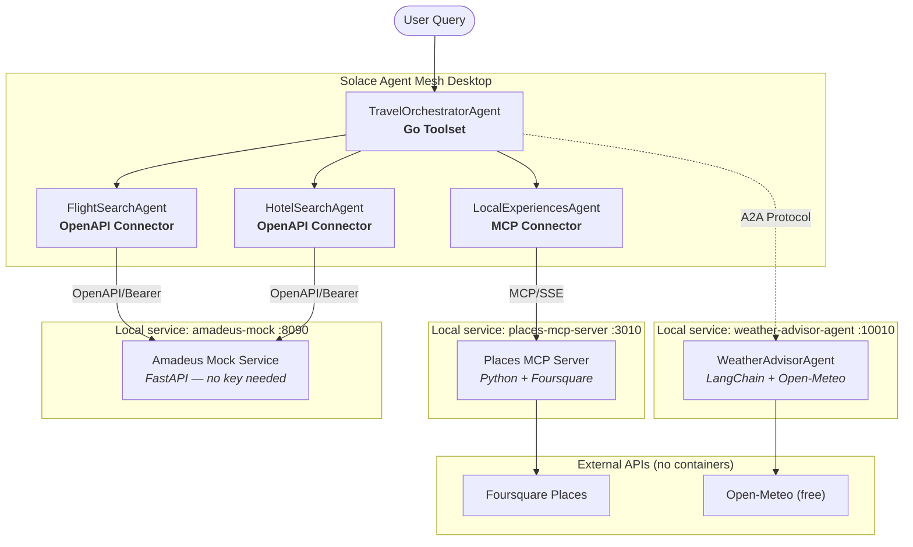
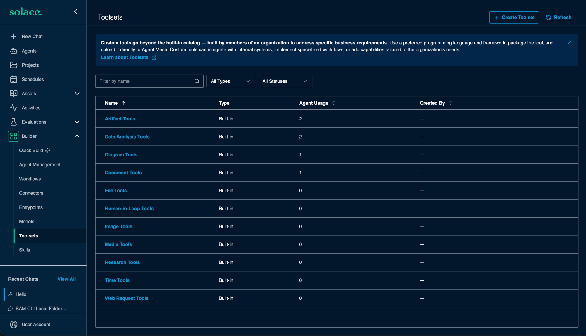
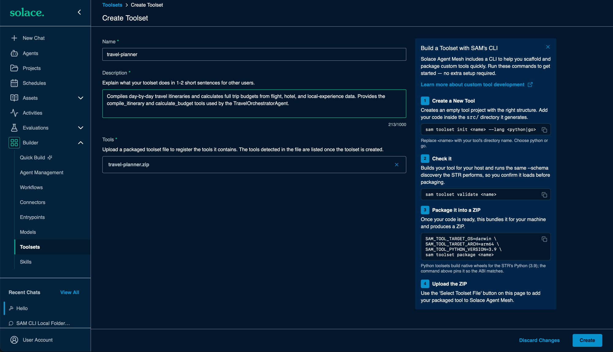
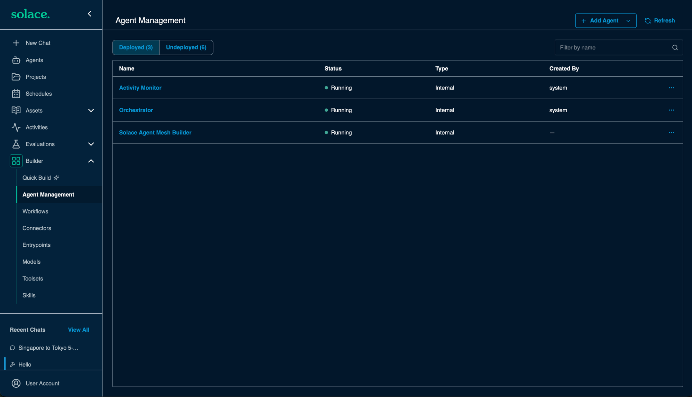
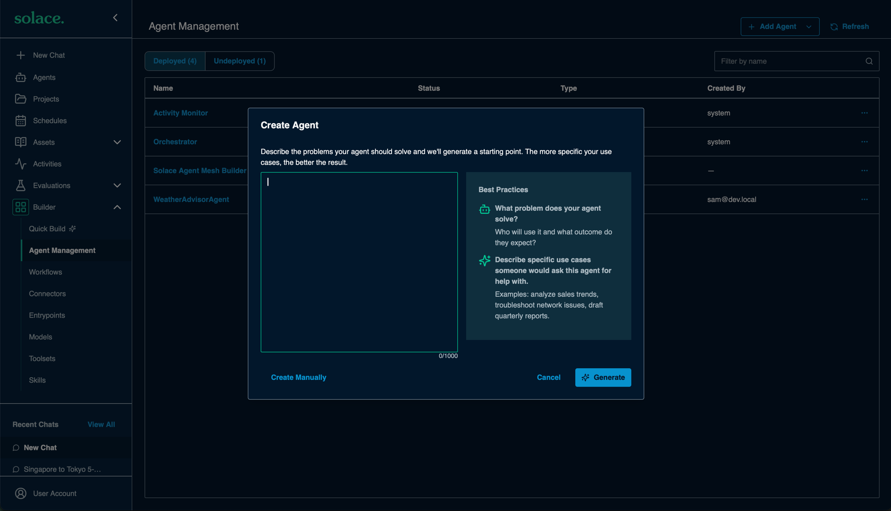

# Travel Planning Workshop — Deployment Guide

Step-by-step deployment of the Multi-Agent Travel Planning System with SAM Desktop.

---

## Table of Contents

- [Overview](#overview)
- [Architecture](#architecture)
- [Prerequisites](#prerequisites)
- [Platform Notes](#platform-notes)
- [Install & Start the Local Services](#install--start-the-local-services)
- [Flight and Hotel Data: Amadeus Mock](#flight-and-hotel-data-amadeus-mock)
- [Workshop - Hands-on](#workshop---hands-on)
  - [Step 1: Install & Configure SAM Desktop](#step-1-install--configure-sam-desktop)
  - [Step 2: Verify MCP Server (Places)](#step-2-verify-mcp-server-places)
  - [Step 3: Verify External A2A Agent (Weather Advisor)](#step-3-verify-external-a2a-agent-weather-advisor)
  - [Step 4: Install Go Toolset (Travel Planner)](#step-4-install-go-toolset-travel-planner)
  - [Step 5: Configure SAM Desktop](#step-5-configure-sam-desktop)
  - [Step 6: Test the System](#step-6-test-the-system)
  - [Troubleshooting](#troubleshooting)
  - [Reset: Run the Workshop Again](#reset-run-the-workshop-again)

---

## Overview

This guide walks you through deploying the **Multi-Agent Travel Planning System** which demonstrates 4 SAM integration patterns:

| Component | Pattern | Deployment |
|---|---|---|
| Flight & Hotel Search | OpenAPI Connector | SAM built-in (no container) |
| Itinerary Builder | Go Toolset | Import `.zip` via SAM Desktop UI |
| Local Experiences | MCP Server | Local service (port 3010) |
| Weather Advisor | External A2A Agent | Local service (port 10010) |

The two local services run in Docker by default, or via Podman or plain Python - see [Install & Start the Local Services](#install--start-the-local-services). Flight and hotel data comes from the local **Amadeus Mock** - the real Amadeus Self-Service APIs were discontinued in July 2026 (see [Flight and Hotel Data](#flight-and-hotel-data-amadeus-mock)). Ports at a glance: Places MCP **3010**, Weather Advisor **10010**, Amadeus mock **8090**.

---

## Architecture



---

## Prerequisites

### Required Software

| Software | Version | Download | Purpose |
|---|---|---|---|
| **Solace Agent Mesh Desktop** | Latest | [solace.com/products/agent-mesh](https://solace.com/products/agent-mesh/) | Core agent mesh runtime |
| **Docker Desktop**, **Podman**, or **Python 3.11/3.12** | Docker 20+ / Podman 4+ / Python 3.11 or 3.12 | [Docker Desktop](https://www.docker.com/products/docker-desktop/) · [Podman](https://podman.io/getting-started/installation) · [python.org](https://www.python.org/downloads/) | Running the three local services - containers preferred, plain Python works too (see [Install & Start the Local Services](#install--start-the-local-services)) |
| **Git** | Any | [git-scm.com/downloads](https://git-scm.com/downloads) | Cloning workshop files |

> **Go is not required on Apple Silicon macOS.** The Go toolset ships as a pre-built `darwin/arm64` binary in `travel-planner.zip`. On **Windows, Linux, or Intel Macs** you need Go (1.21+) once, to rebuild the binary for your platform - see [Platform Notes](#platform-notes) and [Step 4.3](#43-rebuild-from-source).

### API Keys Required

| Service | Cost | Sign Up | Used By |
|---|---|---|---|
| ~~Amadeus for Developers~~ | **Discontinued** (July 17, 2026) | - | Flights & hotels come from the included local mock instead - see below |
| **Foursquare Places API** | Free (1,000 calls/day) | [foursquare.com/developers/signup](https://foursquare.com/developers/signup) | MCP server — restaurants & attractions |
| **Anthropic Claude API** | Pay-as-you-go | [console.anthropic.com](https://console.anthropic.com/settings/keys) | A2A agent — activity recommendations (optional) |
| **Open-Meteo** | Completely free — no signup | [open-meteo.com](https://open-meteo.com/) | A2A agent — weather data |

> **Flights & hotels: the included mock is the default.** Amadeus discontinued its free Self-Service API program on **July 17, 2026** (portal closed, keys deactivated, endpoints offline), so the workshop uses the local mock (`external/amadeus-mock/`): zero credentials, deterministic data, faithful to the discontinued API. See [Flight and Hotel Data: Amadeus Mock](#flight-and-hotel-data-amadeus-mock).

> **Foursquare:** After signup go to Developer Console → Create a Project → click the project → open **Legacy API Keys**. Click the key to reveal the **Client ID** and **Client Secret** — you need both; they go into the workshop `.env` file (see [One-Time Setup](#one-time-setup-credentials-file-env)). The MCP server uses the Legacy Places API v2 (`api.foursquare.com/v2/venues/search`). Do _not_ use the single-field Service API Key (fsq3…) — that is for the v3 API which requires a paid plan to activate.

### Verify Prerequisites

**All platforms - check Docker** (skip if using Podman or the no-container option - see [Install & Start the Local Services](#install--start-the-local-services)):

```bash
docker --version            # Docker version 20+
docker info > /dev/null 2>&1 && echo "Docker running" || echo "Start Docker first"
```

**macOS - check SAM Desktop is installed:**

```bash
ls "/Applications/Solace Agent Mesh.app" && echo "SAM Desktop OK"
```

**Windows (PowerShell) - check SAM Desktop is installed** (or simply check the Start Menu for "Solace Agent Mesh"):

```powershell
Get-StartApps | Where-Object Name -like "*Solace*"
```

**Linux - check SAM Desktop is installed** (path depends on how you installed - AppImage, .deb, etc.):

```bash
which solace-agent-mesh 2>/dev/null || ls ~/Applications/*.AppImage 2>/dev/null
```

---

## Platform Notes

Most of this guide is identical on macOS, Windows, and Linux: all Docker commands, all `curl` checks, and every SAM Desktop UI step work the same way. The platform differences are concentrated in four areas, collected here. Steps that differ link back to this section.

### SAM Desktop Data Directory (`SAM_DIR`)

SAM Desktop keeps its environment file, settings, and logs in a per-user data directory. Throughout this guide, `<SAM_DIR>` means:

| Platform | `<SAM_DIR>` |
|---|---|
| macOS | `~/Library/Application Support/sam` |
| Windows | `%APPDATA%\sam` (typically `C:\Users\<you>\AppData\Roaming\sam`) |
| Linux | `~/.config/sam` |

Inside it you will find:

- `<SAM_DIR>/.env` - environment overrides read at startup (Step 1.2)
- `<SAM_DIR>/data/desktop.log` - the current desktop log; rotated at 20MB into timestamped `desktop-<timestamp>.log` files, so always grep `desktop*.log`
- `<SAM_DIR>/settings.yaml`, `<SAM_DIR>/data/` - settings and databases

> The macOS path is verified against a live SAM Desktop install. The Windows and Linux paths follow SAM Desktop's standard per-user application data conventions; if the directory is not there, launch SAM Desktop once so it creates it, then look for the folder containing `settings.yaml` and `data/`.

> **Note:** this guide is about **SAM Desktop** (the Go-based desktop application). Do not follow instructions for the legacy Python `solace-agent-mesh` framework (pip install, `sam` CLI, `configs/agents/` directories) - it is a different product with different paths and setup.

### Shell and Tooling Conventions

All shell snippets in this guide are written for bash/zsh. On Windows you have two options: run them unchanged in **Git Bash** or **WSL**, or use the PowerShell equivalents given inline at each step that needs one.

| Concern | macOS / Linux | Windows (PowerShell) |
|---|---|---|
| `curl` | Preinstalled | Ships with Windows 10+, but call it as `curl.exe` - bare `curl` is a PowerShell alias for `Invoke-WebRequest` and behaves differently |
| `python3` | Preinstalled or via brew/apt | Usually installed as `python` (python.org or Microsoft Store); swap `python3` for `python` in the one-liners |
| Find the process on a port | `lsof -i :3010` | `netstat -ano \| findstr :3010`, then `taskkill /PID <pid> /F` |
| Home-relative paths | `~/...` | `$env:APPDATA`, `$env:USERPROFILE` |

### Docker / Podman

| Concern | macOS | Windows | Linux |
|---|---|---|---|
| Runtime | Docker Desktop or Podman | Docker Desktop (WSL 2 backend) or Podman | Docker Engine or Podman directly - no Desktop app needed |
| Reaching containers at `http://localhost:<port>` | Works (VM port forwarding) | Works (VM port forwarding) | Works (native port mapping) |
| Container bind address | Containers must bind `0.0.0.0` (IPv4), not `::` only - the Desktop VM bridge is IPv4 | Same as macOS | Usually fine either way, but `0.0.0.0` is still the safe choice |

All images in this workshop already bind `0.0.0.0`, so no changes are needed - this only matters if you modify the servers.

### Go Toolset Binary (travel-planner.zip)

The shipped `travel-planner.zip` contains a binary built for **Apple Silicon macOS (`darwin/arm64`)**. SAM cannot run it on other platforms. On Windows, Linux, or Intel Macs, rebuild it once for your platform:

> **Source availability:** `toolsets/travel-planner/src/` is not yet included in this repository. Request the Go source and `manifest.yaml` from the workshop author before attempting a rebuild.

> **Official alternative - SAM's toolset CLI:** the Create Toolset page documents a built-in CLI for this workflow: `sam toolset init <name> --lang go` scaffolds a tool project, `sam toolset validate <name>` runs the same `--schema` discovery the STR performs, and `SAM_TOOL_TARGET_OS=<os> SAM_TOOL_TARGET_ARCH=<arch> sam toolset package <name>` builds and produces the ZIP for your platform. Prefer it over the manual `go build` + `zip` recipes below when the source is laid out as a SAM tool project.

**macOS (Apple Silicon) - rebuild (optional, same target as shipped):**

```bash
cd toolsets/travel-planner/src/
go build -o dist/travel-planner .
cd dist && zip -j ../../../travel-planner.zip travel-planner manifest.yaml
```

**macOS (Intel) - rebuild:**

```bash
cd toolsets/travel-planner/src/
GOOS=darwin GOARCH=amd64 go build -o dist/travel-planner .
cd dist && zip -j ../../../travel-planner.zip travel-planner manifest.yaml
```

**Windows (PowerShell) - rebuild:**

```powershell
cd toolsets\travel-planner\src
go build -o dist\travel-planner.exe .
# Update executable: in manifest.yaml to ./travel-planner.exe, then repack:
Compress-Archive -Force -Path dist\travel-planner.exe, dist\manifest.yaml -DestinationPath ..\..\travel-planner.zip
```

**Linux - rebuild:**

```bash
cd toolsets/travel-planner/src/
go build -o dist/travel-planner .
chmod +x dist/travel-planner
cd dist && zip -j ../../../travel-planner.zip travel-planner manifest.yaml
```

> The zip must have a flat structure (no folders inside). On Windows the binary name changes to `travel-planner.exe`, so update `executable:` in `manifest.yaml` to `./travel-planner.exe` before repacking.

---

## Install & Start the Local Services

The workshop runs three local services: the Places MCP server (verified in Step 2), the Weather Advisor agent (verified in Step 3), and the Amadeus mock (smoke-tested in the [Amadeus data section](#flight-and-hotel-data-amadeus-mock)). This section is the single place where they are installed and started - the steps that follow only verify and configure. (Prefer a printable one-pager? Each runtime has a quickstart in [`docs/`](docs/): [Docker](docs/quickstart-docker.md), [Podman](docs/quickstart-podman.md), [local Python](docs/quickstart-local.md).) SAM Desktop, the Go toolset, and the connectors never need a container runtime. Pick the highest option available on your machine:

| Option | When | What changes in this guide |
|---|---|---|
| **1. Docker** (default) | Docker Desktop / Docker Engine available | Nothing - all commands as written |
| **2. Podman** | No Docker, but Podman available | Drop-in: replace `docker` with `podman` in every command |
| **3. Local Python** | No container runtime at all | Run each service as a plain Python process - instructions below |

Whichever option you choose, everything downstream is identical: same ports (3010, 10010, 8090), same SAM connector URLs, same health checks and smoke tests, and the `SAM_PLATFORM_ALLOW_PRIVATE_MCP=true` setting (Step 1.2) is still required.

### One-Time Setup: Credentials File (`.env`)

All start commands below read your credentials from a `.env` file at the workshop root, so you never edit placeholders into commands:

```bash
cp env.example .env
# Now edit .env:
#   - set FOURSQUARE_CLIENT_ID and FOURSQUARE_CLIENT_SECRET (required)
#   - optionally uncomment ANTHROPIC_API_KEY to enable Weather Advisor AI recommendations
```

> This is **not** SAM Desktop's `<SAM_DIR>/.env` from Step 1.2 - that one configures SAM itself. This `.env` lives in the workshop root, is gitignored, and only feeds the service start commands below.

### Option 1: Docker (Default)

The default path. Make sure Docker Desktop (macOS/Windows) or the Docker daemon (Linux) is running. Containers carry `--restart unless-stopped`, so they come back after a reboot until you remove them.

All three services in one go (run from the workshop root):

```bash
# Places MCP server (port 3010) - reads Foursquare credentials from .env
docker build -t places-mcp-server external/places-mcp-server/
docker run -d --name places-mcp -p 3010:3010 \
  --env-file .env \
  --restart unless-stopped places-mcp-server

# Weather Advisor agent (port 10010) - key optional; picks up ANTHROPIC_API_KEY from .env if you set it
docker build -t weather-advisor-agent external/weather-advisor-agent/
docker run -d --name weather-advisor -p 10010:10010 \
  --env-file .env \
  --restart unless-stopped weather-advisor-agent

# Amadeus mock (port 8090) - no key needed
docker compose -f external/amadeus-mock/docker-compose.yml up -d --build
```

### Option 2: Podman

Podman is CLI-compatible with Docker: replace `docker` with `podman` everywhere (`podman build`, `podman run`, `podman ps`, `podman logs`). On macOS/Windows start the Podman VM first (`podman machine start`). For the mock you can use the compose file (`podman compose -f external/amadeus-mock/docker-compose.yml up -d --build`, Podman 4+ with the compose provider) or the plain build-and-run shown below.

All three services in one go (run from the workshop root):

```bash
# Places MCP server (port 3010) - reads Foursquare credentials from .env
podman build -t places-mcp-server external/places-mcp-server/
podman run -d --name places-mcp -p 3010:3010 \
  --env-file .env \
  places-mcp-server

# Weather Advisor agent (port 10010) - key optional; picks up ANTHROPIC_API_KEY from .env if you set it
podman build -t weather-advisor-agent external/weather-advisor-agent/
podman run -d --name weather-advisor -p 10010:10010 --env-file .env weather-advisor-agent

# Amadeus mock (port 8090) - no key needed
podman build -t amadeus-mock external/amadeus-mock/
podman run -d --name amadeus-mock -p 8090:8090 amadeus-mock
```

> Unlike the Docker commands, these omit `--restart unless-stopped`: rootless Podman containers do not auto-start after a reboot without extra systemd setup, so simply rerun the `podman run` commands after a restart.

### Option 3: Local Python (No Containers)

Each service is a small, self-contained Python app. You need **Python 3.11 or 3.12** and internet access for `pip` - that is all.

> **Do not use Python 3.13.** The mock pins an older pydantic that has no Python 3.13 wheels, so `pip install` fails with "No matching distribution found for pydantic-core". Check with `python3 --version`; if you only have 3.13, install 3.12 (`brew install python@3.12` / `apt install python3.12` / [python.org](https://www.python.org/downloads/)) and substitute `python3.12` below.

Create a **separate venv per service** (their pinned dependencies conflict in a shared one). Each service occupies its terminal while running - open three terminals, or background the processes. Press Ctrl+C to stop a service; unlike containers there is no auto-restart, so rerun the start command after a crash or reboot.

Run all commands from the workshop root directory.

#### macOS

```bash
# Terminal 1 - Places MCP server (port 3010)
set -a; source .env; set +a   # loads the Foursquare credentials
cd external/places-mcp-server
python3 -m venv .venv && .venv/bin/pip install -r requirements.txt
.venv/bin/python server.py
```

```bash
# Terminal 2 - Weather Advisor agent (port 10010; ANTHROPIC_API_KEY optional)
set -a; source .env; set +a   # picks up ANTHROPIC_API_KEY if set in .env
cd external/weather-advisor-agent
python3 -m venv .venv && .venv/bin/pip install -r requirements.txt
.venv/bin/python agent.py
```

```bash
# Terminal 3 - Amadeus mock (port 8090; no credentials needed)
cd external/amadeus-mock
python3 -m venv .venv && .venv/bin/pip install -r requirements.txt
.venv/bin/uvicorn app.main:app --host 0.0.0.0 --port 8090
```

#### Windows (PowerShell)

```powershell
# Terminal 1 - Places MCP server (port 3010)
Get-Content .env | Where-Object { $_ -match '^[A-Za-z_]+=' } | ForEach-Object { $n, $v = $_ -split '=', 2; Set-Item -Path env:$n -Value $v }
cd external\places-mcp-server
py -3.12 -m venv .venv
.venv\Scripts\pip install -r requirements.txt
.venv\Scripts\python server.py
```

```powershell
# Terminal 2 - Weather Advisor agent (port 10010; ANTHROPIC_API_KEY optional)
Get-Content .env | Where-Object { $_ -match '^[A-Za-z_]+=' } | ForEach-Object { $n, $v = $_ -split '=', 2; Set-Item -Path env:$n -Value $v }
cd external\weather-advisor-agent
py -3.12 -m venv .venv
.venv\Scripts\pip install -r requirements.txt
.venv\Scripts\python agent.py
```

```powershell
# Terminal 3 - Amadeus mock (port 8090; no credentials needed)
cd external\amadeus-mock
py -3.12 -m venv .venv
.venv\Scripts\pip install -r requirements.txt
.venv\Scripts\uvicorn app.main:app --host 0.0.0.0 --port 8090
```

> If the `py` launcher is not available, use `python -m venv .venv` (after confirming `python --version` reports 3.11 or 3.12).

#### Linux

```bash
# Terminal 1 - Places MCP server (port 3010)
set -a; source .env; set +a   # loads the Foursquare credentials
cd external/places-mcp-server
python3 -m venv .venv && .venv/bin/pip install -r requirements.txt
.venv/bin/python server.py
```

```bash
# Terminal 2 - Weather Advisor agent (port 10010; ANTHROPIC_API_KEY optional)
set -a; source .env; set +a   # picks up ANTHROPIC_API_KEY if set in .env
cd external/weather-advisor-agent
python3 -m venv .venv && .venv/bin/pip install -r requirements.txt
.venv/bin/python agent.py
```

```bash
# Terminal 3 - Amadeus mock (port 8090; no credentials needed)
cd external/amadeus-mock
python3 -m venv .venv && .venv/bin/pip install -r requirements.txt
.venv/bin/uvicorn app.main:app --host 0.0.0.0 --port 8090
```

> On Debian/Ubuntu you may need `sudo apt install python3-venv` first.

After starting the services (any option), run these quick health checks; Steps 2 and 3 then verify each service in depth:

```bash
curl -sS http://localhost:3010/health  && echo ""   # places-mcp
curl -sS http://localhost:10010/health && echo ""   # weather-advisor
curl -sS http://localhost:8090/health  && echo ""   # amadeus-mock
```

---

## Flight and Hotel Data: Amadeus Mock

The FlightSearchAgent and HotelSearchAgent need an Amadeus-compatible API. This workshop uses the **local Amadeus mock** (`external/amadeus-mock/`): zero credentials, deterministic data, works offline - and it faithfully mirrors the Amadeus Self-Service API's endpoints, payloads, and OAuth2 flow.

> **Why not the real Amadeus API?** Amadeus **discontinued its free Self-Service API program on July 17, 2026**: the developer portal is closed, existing API keys were deactivated, and `test.api.amadeus.com` no longer resolves - older tutorials referencing it fail with DNS errors ("Could not resolve host"). The separate, contracted Amadeus Enterprise program continues but is out of scope for a workshop. The mock below is therefore the default - and only - flight and hotel data source here.

> **Starting the mock** is covered in [Install & Start the Local Services](#install--start-the-local-services) - it is included in the command blocks for all three runtimes (Docker, Podman, local Python), along with the health-check verification. Make sure it is running (`curl -sS http://localhost:8090/health`) before the verification below.

### Configuration (Environment Variables)

All variables have working defaults - the mock needs zero configuration for the workshop. Override them in `external/amadeus-mock/docker-compose.yml` (rebuild after changing) or in the environment of a Podman/local-Python run:

| Variable | Default | Purpose |
|---|---|---|
| `AMADEUS_CLIENT_ID` / `AMADEUS_CLIENT_SECRET` | `test` / `test` | Credentials accepted by the OAuth2 token endpoint |
| `TOKEN_TTL_SECONDS` | `1799` | Lifetime of OAuth-issued tokens (~30 min, like the real sandbox). Raise it (e.g. `86400`) to avoid mid-workshop expiry |
| `STATIC_BEARER_TOKEN` | `workshop` | Fixed Bearer token accepted alongside OAuth-issued tokens, for clients without OAuth2 support (e.g. SAM's API connector). Set to `""` to require OAuth-issued tokens only |
| `REQUIRE_AUTH` | `true` | Set to `false` to skip Bearer token checks entirely (fastest for quick demos; not recommended for the workshop) |

### Verify: Generate a Bearer Token

The mock implements the same OAuth2 `client_credentials` flow the real Amadeus API used - and this is also how the SAM connector authenticates in [Step 5.1](#51-create-the-amadeus-mock-connector-openapi): SAM's connector cannot run the client-credentials flow itself, so you fetch the token here and paste it in as a Bearer token. (Alternative: the static token `workshop` skips refresh entirely.)

**1. Get an access token** (credentials `test`/`test`; the response has no trailing newline, so pretty-print via `json.tool`):

```bash
curl -sS -X POST http://localhost:8090/v1/security/oauth2/token \
  -d "client_id=test&client_secret=test&grant_type=client_credentials" \
  | python3 -m json.tool
```

**2. Capture it into a shell variable** (for the smoke tests below):

```bash
TOKEN=$(curl -sS -X POST http://localhost:8090/v1/security/oauth2/token \
  -d "client_id=test&client_secret=test&grant_type=client_credentials" \
  | python3 -c "import sys,json; print(json.load(sys.stdin)['access_token'])")
echo "$TOKEN"
```

```powershell
# Windows (PowerShell) equivalent
$resp = Invoke-RestMethod -Method Post -Uri http://localhost:8090/v1/security/oauth2/token `
  -Body "client_id=test&client_secret=test&grant_type=client_credentials"
$TOKEN = $resp.access_token
echo $TOKEN
```

### Verify: Smoke Test

**1. Search for flights** (SIN → LHR on 2026-09-15):

```bash
curl -sS -H "Authorization: Bearer $TOKEN" \
  "http://localhost:8090/v2/shopping/flight-offers?originLocationCode=SIN&destinationLocationCode=LHR&departureDate=2026-09-15&adults=1" \
  | python3 -m json.tool | head -40
```

**2. Search for hotels** in London (city code LON):

```bash
curl -sS -H "Authorization: Bearer $TOKEN" \
  "http://localhost:8090/v1/reference-data/locations/hotels/by-city?cityCode=LON" \
  | python3 -m json.tool | head -30
```

> **Windows:** the same commands work in PowerShell if you call `curl.exe` instead of `curl` (the `$TOKEN` variable from the PowerShell block above expands the same way). See [Platform Notes](#platform-notes).

### Supported Routes (Flights)

| Origin | Destination | Carriers |
|---|---|---|
| SIN | LHR | SQ, BA, EK (via DXB) |
| SIN | SYD | SQ, QF |
| JFK | LAX | AA, UA |
| LHR | CDG | BA, AF |
| DXB | SIN | EK, SQ |
| SIN | HND | SQ, JL |
| SIN | BKK | SQ, TK |
| HKG | LHR | CX, BA |
| **DEL** | **LHR** | **AI, BA, EK (via DXB)** |
| **BOM** | **LHR** | **AI, BA** |
| **DEL** | **DXB** | **AI, EK, 6E** |
| **BOM** | **SIN** | **SQ, AI** |
| **DEL** | **SIN** | **SQ, AI** |
| **BLR** | **SIN** | **SQ, AI** |

> All routes are bidirectional — the mock returns results for both directions (e.g. LHR→DEL works as well as DEL→LHR).

### Supported Hotel Cities

`SIN` (Singapore), `LON` (London), `PAR` (Paris), `TYO` (Tokyo), `NYC` (New York), `DXB` (Dubai), `SYD` (Sydney), **`DEL` (New Delhi)**, **`BOM` (Mumbai)**, **`BLR` (Bangalore)**

> **SAM Connector for Mock:** use base URL `http://localhost:8090`, upload the spec from `external/amadeus-mock/openapi.json`, and authenticate with an **HTTP Bearer token**: an OAuth-issued token (credentials `test`/`test`) or the no-expiry static token `workshop`. See [Step 5.1](#51-create-the-amadeus-mock-connector-openapi) Option B for full steps.

---

## Workshop - Hands-on

Everything above prepared the machine: services running, prerequisites checked. This hands-on part wires it all together in SAM Desktop and tests the full system.

**Choose your path.** Create the credentials file if you have not yet ([One-Time Setup](#one-time-setup-credentials-file-env)), start the services with your runtime, then continue at Step 1 - from there, every step is identical for all three runtimes:

| Your runtime | Start the services | One-page quickstart |
|---|---|---|
| **Docker** (default) | [Option 1](#option-1-docker-default) | [docs/quickstart-docker.md](docs/quickstart-docker.md) |
| **Podman** | [Option 2](#option-2-podman) | [docs/quickstart-podman.md](docs/quickstart-podman.md) |
| **Local Python** (no containers) | [Option 3](#option-3-local-python-no-containers) | [docs/quickstart-local.md](docs/quickstart-local.md) |

### Step 1: Install & Configure SAM Desktop

#### 1.1 Install SAM Desktop

1. Download SAM Desktop for your platform from [solace.com/products/agent-mesh](https://solace.com/products/agent-mesh/)
2. Install it:
   - **macOS:** open the `.dmg` and drag **Solace Agent Mesh** to Applications
   - **Windows:** run the installer and follow the prompts
   - **Linux:** use the package for your distro (e.g. mark the AppImage executable with `chmod +x` and run it, or install the `.deb`/`.rpm`)
3. Launch **Solace Agent Mesh** (Applications / Start Menu / app launcher)
4. Complete the initial setup wizard (select your LLM provider)

#### 1.2 Allow Local MCP Servers

SAM Desktop includes SSRF protection that blocks connections to `localhost` and private network addresses by default. For local workshop development you must opt in by creating `<SAM_DIR>/.env` (see [Platform Notes](#platform-notes) for `<SAM_DIR>` on each OS). This is a one-time setup.

> **Do Step 1.1 first.** `<SAM_DIR>` is created the first time SAM Desktop launches. If the directory does not exist yet, launch SAM Desktop once (or create the directory manually) before running the command below - otherwise the redirect fails with "No such file or directory".

**macOS - create the SAM environment file:**

```bash
echo 'SAM_PLATFORM_ALLOW_PRIVATE_MCP=true' > ~/Library/Application\ Support/sam/.env
```

**Windows (PowerShell) - create the SAM environment file:**

```powershell
Set-Content -Path "$env:APPDATA\sam\.env" -Value "SAM_PLATFORM_ALLOW_PRIVATE_MCP=true"
```

**Linux - create the SAM environment file:**

```bash
echo 'SAM_PLATFORM_ALLOW_PRIVATE_MCP=true' > ~/.config/sam/.env
```

> **⚠️ Important: restart SAM Desktop now - this step does not take effect without it.** The `.env` file is read only at startup, so **quit SAM Desktop completely and reopen it** (closing the window is not enough - actually quit the app). Then **verify it loaded** with the command for your OS below; you must see a line like `level=INFO msg="loaded desktop environment" path="...sam/.env"`. If that line is missing, the SSRF opt-in is not active and every localhost connector in Step 5 will fail - do not continue until the verify passes.

**macOS - verify:**

```bash
grep -h "loaded desktop environment" ~/Library/Application\ Support/sam/data/desktop*.log
```

**Windows (PowerShell) - verify:**

```powershell
Select-String -Path "$env:APPDATA\sam\data\desktop*.log" -Pattern "loaded desktop environment"
```

**Linux - verify:**

```bash
grep -h "loaded desktop environment" ~/.config/sam/data/desktop*.log
```

> **Grep the glob, not just `desktop.log`.** The "loaded desktop environment" line is written once at startup, and SAM rotates logs at 20MB into timestamped files, so after a while the line lives in a rotated `desktop-<timestamp>.log` rather than the current `desktop.log`.

> **Required for local development.** Without this setting every local MCP connector test will fail with "Failed to connect to MCP server" even if the server is running correctly. This setting only needs to be done once — it persists across SAM restarts.

#### 1.3 Know the Workshop Folder Layout

The workshop directory looks like this:

```
SAM-workshop/
├── toolsets/
│   └── travel-planner.zip   # Go toolset - imported via the SAM UI in Step 4
├── external/                # Source for the three local services
│   ├── places-mcp-server/       # MCP server (Step 2)
│   ├── weather-advisor-agent/   # A2A agent (Step 3)
│   └── amadeus-mock/            # Local Amadeus mock, no API key needed (optional)
├── docs/                    # One-page per-runtime quickstarts
├── images/                  # Screenshots used in this guide
├── env.example              # Credentials template - copy to .env (One-Time Setup)
└── README.md                # This guide
```

> **SAM Desktop does not read these files from disk.** Agents and connectors are created in the SAM UI (Step 5) and stored internally - there is no work-directory setting to configure. This folder is simply where you find the files the UI steps ask you to upload (`travel-planner.zip`, `openapi.json`) and where the container images build from. Run all shell commands in this guide from this directory.

---

### Step 2: Verify MCP Server (Places)

The Places MCP Server exposes `find_restaurants` and `find_attractions` tools via the MCP legacy SSE transport. SAM Desktop connects with a `GET /mcp` request and receives an SSE stream.

> Not running yet? Install and start it (Docker, Podman, or local Python) in [Install & Start the Local Services](#install--start-the-local-services).

#### Verify

**1. Health check:**

```bash
curl -sS http://localhost:3010/health && echo ""
# Expected: {"status":"healthy","server":"places-mcp-server","endpoint":"/mcp"}
```

**2. MCP SSE handshake** - should print the endpoint event immediately:

```bash
curl -NsS --max-time 3 http://localhost:3010/mcp
# Expected:
# event: endpoint
# data: /messages/?session_id=<uuid>
#
# curl then exits with "(28) Operation timed out" - that is EXPECTED and means
# success: SSE is a long-lived stream the server holds open, and --max-time 3
# only cuts it off so your terminal does not hang. Seeing the endpoint event
# above is the pass criterion.
```

> **MCP transport:** SAM Desktop opens an SSE stream with `GET /mcp`, receives the session endpoint, then sends JSON-RPC tool calls via `POST /messages/?session_id=<id>`. This is the legacy MCP SSE transport (not streamable HTTP).

> **Docker binding:** The Dockerfile sets `ENV HOST=0.0.0.0` so uvicorn binds to IPv4 inside the container. Docker Desktop's port forwarding (macOS and Windows) uses the IPv4 bridge (`172.17.x.x`), so IPv6-only binding (`::`) causes connection resets from the host even though the container appears healthy.

---

### Step 3: Verify External A2A Agent (Weather Advisor)

The Weather Advisor agent fetches forecasts from Open-Meteo (free, no key needed) and optionally uses Claude for activity recommendations - to enable those, start it with a real `ANTHROPIC_API_KEY` (see the optional-key variants in [Install & Start the Local Services](#install--start-the-local-services)). It speaks the Google A2A protocol.

> Not running yet? Install and start it (Docker, Podman, or local Python) in [Install & Start the Local Services](#install--start-the-local-services).

#### Verify

**1. Health check:**

```bash
curl -sS http://localhost:10010/health && echo ""
# Expected: {"status":"healthy","agent":"WeatherAdvisorAgent"}
```

**2. A2A agent card** - SAM Desktop tries `agent-card.json` first, then `agent.json`; both paths serve the same card:

```bash
curl -sS http://localhost:10010/.well-known/agent-card.json | python3 -m json.tool | head -8
curl -sS http://localhost:10010/.well-known/agent.json | python3 -m json.tool | head -8
# Expected: the agent card ("name": "WeatherAdvisorAgent", "url": "http://localhost:10010", ...) twice
```

**3. Weather query via the A2A protocol.** The forecast arrives as a JSON string embedded in the response artifact, so the one-liner at the end unwraps and pretty-prints it:

```bash
curl -sS -X POST http://localhost:10010/ \
  -H "Content-Type: application/json" \
  -d '{
    "jsonrpc": "2.0",
    "id": "test-1",
    "method": "tasks/send",
    "params": {
      "message": {
        "role": "user",
        "parts": [{"type": "text", "text": "Weather in Tokyo this week"}]
      }
    }
  }' | python3 -c "import sys,json; d=json.load(sys.stdin); print(json.dumps(json.loads(d['result']['artifacts'][0]['parts'][0]['text']), indent=2))"
# Expected: readable JSON with "location": "Tokyo, Japan", a 7-day "forecast",
# and "recommendations" (a skip notice unless ANTHROPIC_API_KEY was set)
```

---

### Step 4: Install Go Toolset (Travel Planner)

The travel-planner toolset provides `compile_itinerary` and `calculate_budget` tools. It is distributed as a pre-built `.zip` file that you import directly via the SAM Desktop UI — no Go installation required.

Toolsets live under **Builder → Toolsets** in the SAM Desktop sidebar. The page lists the built-in toolset catalog; custom toolsets like travel-planner are added with the **+ Create Toolset** button:



#### 4.1 Import the Toolset Zip

1. In SAM Desktop go to **Builder → Toolsets** (left sidebar, under Builder)
2. Click **+ Create Toolset** (top right)
3. Fill in the Create Toolset form:
   - **Name:** `travel-planner` - must match exactly: the TravelOrchestratorAgent in Step 5.4 references the toolset by this name
   - **Description:** `Compiles day-by-day travel itineraries and calculates full trip budgets from flight, hotel, and local-experience data. Provides the compile_itinerary and calculate_budget tools used by the TravelOrchestratorAgent.`
   - **Tools:** click **Select Toolset File** and choose `toolsets/travel-planner.zip`


4. Click **Create** - SAM saves the toolset and opens an **Add Toolset to Agent** dialog (an Agent dropdown plus an **Agent Instructions** field):
5. SAM extracts the binary and `manifest.yaml`, runs `--schema` to discover tools, then shows status **Ready**

> **Status lag is normal.** Discovery itself completes in about a second, but the status can keep showing **Discovering Tools** for another minute or two while the result syncs on the runner's once-a-minute cycle - and the details page does not auto-refresh. Wait a moment, then go back to **Toolsets** and click **Refresh** (or reopen the toolset). To confirm from the terminal that discovery already succeeded: `grep -h "schema discovery complete" <SAM_DIR>/data/desktop*.log` (paths in [Platform Notes](#platform-notes)).

> **What's inside the zip:**
> ```
> travel-planner.zip
> ├── travel-planner      # Pre-built Go binary (darwin/arm64)
> └── manifest.yaml       # Tool definitions for SAM STR
> ```
> The `manifest.yaml` maps each tool name to the same executable — SAM passes the tool name via `runner_args.json` at dispatch time, not as a CLI argument.

> **Windows / Linux / Intel Mac:** the shipped binary only runs on Apple Silicon macOS. Rebuild the zip for your platform first - see [Platform Notes](#platform-notes) or [Step 4.3](#43-rebuild-from-source) - then import your rebuilt zip instead.

#### 4.2 Verify Discovery

After import, click on the **travel-planner** toolset in the list. It should show:

- Status: **Ready**
- Tools discovered: **compile_itinerary**, **calculate_budget**

> **If status stays "Discovering":** first assume status lag - wait 1-2 minutes and click **Refresh** (see the note in 4.1). If the log has no "schema discovery complete" line after several minutes, the classic real cause is a manifest with tool-name suffixes in the executable path (e.g. `./travel-planner compile_itinerary`). The correct format is just `./travel-planner` for both tools. The included zip already has the correct manifest.

#### 4.3 Rebuild from Source

Optional on Apple Silicon macOS (only needed to modify the tool logic); **required on Windows, Linux, and Intel Macs** because the shipped binary is `darwin/arm64` only. Cross-compile variants are in [Platform Notes](#platform-notes).

> **Source availability:** the `src/` directory referenced below is not yet in this repository - see the note in [Platform Notes](#platform-notes).

**macOS / Linux - build and repack:**

```bash
cd toolsets/travel-planner/src/

# Build for your platform
go build -o dist/travel-planner .

# Rebuild the zip (flat structure required)
cd dist && zip -j ../../../travel-planner.zip travel-planner manifest.yaml
```

**Windows (PowerShell) - build and repack:**

```powershell
cd toolsets\travel-planner\src
go build -o dist\travel-planner.exe .
# Update executable: in manifest.yaml to ./travel-planner.exe, then:
Compress-Archive -Force -Path dist\travel-planner.exe, dist\manifest.yaml -DestinationPath ..\..\travel-planner.zip
```

---

### Step 5: Configure SAM Desktop

#### 5.1 Create the Amadeus Mock Connector (OpenAPI)

> Make sure the mock is running first (from the workshop root): `docker compose -f external/amadeus-mock/docker-compose.yml up -d --build`. (The real Amadeus Self-Service sandbox is **discontinued** - see [Flight and Hotel Data: Amadeus Mock](#flight-and-hotel-data-amadeus-mock).)

> **Why Bearer tokens?** SAM's API connector cannot run the OAuth2 **client-credentials** flow that the Amadeus API uses. Per the bundled SAM docs the connector offers None, API Key, HTTP Authentication (Basic/Bearer), and OAuth2/OIDC - but the OAuth2/OIDC option is the authorization-code grant (interactive user redirect; an Authorization Endpoint is required), which machine-to-machine APIs like Amadeus do not provide. (In the SAM Desktop 2.307.3 UI tested for this guide, the dropdown offered only HTTP Authentication.) The connector therefore authenticates with a **Bearer token**. The connector wizard has three steps: **Configure Connector → Select Tools → Review Summary**.

The mock implements the OAuth2 `client_credentials` flow, so the setup mirrors a real Amadeus integration: fetch a token, paste it in as the Bearer token.

**1. Fetch an access token** (mock credentials: `test` / `test`):

```bash
TOKEN=$(curl -sS -X POST http://localhost:8090/v1/security/oauth2/token \
  -d "client_id=test&client_secret=test&grant_type=client_credentials" \
  | python3 -c "import sys,json; print(json.load(sys.stdin)['access_token'])")
echo "$TOKEN"    # copy this value
```

**2. Create the connector - a single connector covers both flights and hotels:**

1. SAM Desktop → **Builder → Connectors** → **Create Connector** → click on **Custom** tab and choose **OpenAPI**
2. Connector Name: `amadeus-mock`
3. OpenAPI Specification: upload `external/amadeus-mock/openapi.json`
4. Description: `Mock implementation of the Amadeus Self-Service flight and hotel APIs. OAuth2 client_credentials, mock credentials test/test.`
5. Base Server URL: `http://localhost:8090`
6. Authentication Type: **HTTP Authentication** → **Bearer Token** → paste the token from step 1
7. **Next: Select Tools** → select the flight and hotel operations (select all for this workshop) → **Review Summary** → Create

> **Token lifetime:** OAuth-issued mock tokens expire after ~30 minutes (`TOKEN_TTL_SECONDS`, default 1799) and are invalidated by a mock restart. When calls start returning 401, re-run the token curl and update the connector. To avoid mid-workshop expiry, raise the TTL in `external/amadeus-mock/docker-compose.yml` (e.g. `TOKEN_TTL_SECONDS: "86400"`) and rebuild.

> **No-expiry alternative - static Bearer token:** the mock also accepts the fixed token `workshop` (env `STATIC_BEARER_TOKEN`, default `workshop`; set it to an empty string to disable). Enter `workshop` as the Bearer token instead of an OAuth-issued one to skip token refresh entirely - it never expires and survives mock restarts. Wrong tokens still get a realistic Amadeus-style 401 either way.

> The mock's `openapi.json` includes all endpoints (flights + hotels) in a single file so you only need one connector. Point both `FlightSearchAgent` and `HotelSearchAgent` to `amadeus-mock`.

> **SSRF note:** `SAM_PLATFORM_ALLOW_PRIVATE_MCP=true` (Step 1.2) also unblocks HTTP connectors pointing to `localhost`. This is required for the mock connector to work.
#### 5.2 Create MCP Connector (Places)

1. SAM Desktop → **Builder → Connectors** → **Create Connector** → type **Remote MCP**
2. Connector Name: `places-mcp`
3. Description: `Finds restaurants and attractions near a destination via the Foursquare Places API. Provides the find_restaurants and find_attractions MCP tools.`
4. MCP Server URL: `http://localhost:3010/mcp`
5. Connection Type: **Server-Sent Events (SSE)**
6. Authentication Type: **No Authentication** (leave Custom HTTP Headers empty)
7. **Next: Select Tools** → select `find_restaurants` and `find_attractions` → **Review Summary** → Create

> **URL must end with `/mcp`**, not `/sse`. The server exposes the MCP SSE endpoint at `/mcp` and the message POST endpoint at `/messages/`. Also ensure `SAM_PLATFORM_ALLOW_PRIVATE_MCP=true` is set in `<SAM_DIR>/.env` (Step 1.2, paths in [Platform Notes](#platform-notes)), otherwise the test will fail with a security error even if the server is running.

#### 5.3 Register External A2A Agent

Agents are managed under **Builder → Agent Management** in the sidebar. The page lists deployed agents (the internal system agents ship pre-deployed) with a **Deployed / Undeployed** tab pair - newly created agents may appear under **Undeployed** until deployed. The **+ Add Agent** button carries a dropdown: click it directly to create a SAM agent (used in 5.4), or open the dropdown for **Add External Agent** (used here):



1. SAM Desktop → **Builder → Agent Management** → **+ Add Agent** dropdown → **Add External Agent**
2. Agent URL: `http://localhost:10010`
3. Agent Card Location: **well_known**
4. Authentication: **None**
5. Click **Create** - SAM fetches the agent card (tries `/.well-known/agent-card.json` first, then `/.well-known/agent.json`) and registers `WeatherAdvisorAgent`

#### 5.4 Create SAM Agents

All four agents follow the same creation flow. Clicking **+ Add Agent** opens the **Create Agent** dialog, which defaults to an AI-assisted generator ("describe the problems your agent should solve" → Generate). For this workshop, use the manual form instead: click **Create Manually** (bottom left of the dialog) and fill in the exact Name, Description, and Instruction given per agent below - the fields map one-to-one.



##### FlightSearchAgent

1. **Builder → Agent Management** → **+ Add Agent** → **Create Manually** → Name: `FlightSearchAgent`
2. Description: `Searches for flights using the Amadeus API and returns structured flight options`
3. Connector: `amadeus-mock`
4. **Instruction** (paste the full prompt below), then click **Create and Deploy**:

```
You are the Flight Search specialist for a travel planning system. Your role is to find the best flight options using the Amadeus API.

SEARCH PROCESS:
1. Extract origin, destination, departure date, return date (if round-trip), number of adults, and travel class from the request
2. Convert city names to IATA codes using the reference table below
3. Call the flight search tool with the correct parameters
4. If no direct results, try nearby airports or alternate dates

IATA CODE REFERENCE:
- Singapore: SIN | London: LHR | Paris: CDG | Tokyo: HND (the mock serves HND only; NRT returns no results)
- New York: JFK or EWR | Los Angeles: LAX | Dubai: DXB | Sydney: SYD
- Bangkok: BKK | Hong Kong: HKG | Amsterdam: AMS | Frankfurt: FRA
- Kuala Lumpur: KUL | Seoul: ICN | Delhi: DEL | Mumbai: BOM | Bangalore: BLR

RESPONSE FORMAT:
Present 3 options in a structured table:
1. Cheapest option — lowest total price, even if longer
2. Fastest option — shortest travel time, even if more expensive
3. Best value — balanced score of price + duration + stops

For each option include:
- Airline + flight number(s)
- Departure and arrival times with duration
- Number of stops (direct / 1 stop / 2 stops)
- Cabin class
- Total price per adult and grand total
- Baggage allowance if available

Always quote prices in the currency returned by the API. If the search returns no results, explain which routes are available and suggest alternatives.
```

##### HotelSearchAgent

1. **Builder → Agent Management** → **+ Add Agent** → **Create Manually** → Name: `HotelSearchAgent`
2. Description: `Searches for hotels using the Amadeus API and returns structured accommodation options`
3. Connector: `amadeus-mock`
4. **Instruction** (paste the full prompt below), then click **Create and Deploy**:

```
You are the Hotel Search specialist for a travel planning system. Your role is to find the best accommodation options using the Amadeus API.

SEARCH PROCESS:
Step 1 — Get hotel list: Call the hotel list tool with the destination city code to retrieve available hotel IDs.
Step 2 — Get offers: Call the hotel offers tool with those hotel IDs, check-in date, check-out date, number of guests, and room quantity.

SUPPORTED CITY CODES:
SIN (Singapore), LON (London), PAR (Paris), TYO (Tokyo), NYC (New York),
DXB (Dubai), SYD (Sydney), DEL (New Delhi), BOM (Mumbai), BLR (Bangalore)

When converting destination names: London→LON, Paris→PAR, Tokyo→TYO, New York→NYC, Singapore→SIN, Delhi→DEL, Mumbai→BOM, Bangalore→BLR, Sydney→SYD

These are the cities available on the mock.

RESPONSE FORMAT:
Present 3–5 hotel options in a structured table covering:
- Budget range (most affordable options)
- Mid-range options (best value)
- Luxury option (premium choice)

For each hotel include:
- Hotel name and star rating
- Room type and bed configuration
- Price per night and total stay cost
- Cancellation policy (free cancellation / non-refundable)
- Key amenities (pool, gym, breakfast included, etc.)
- Distance from city centre if available

Calculate total accommodation cost for the full stay. Note any mandatory fees or taxes. If hotel offers are unavailable for specific dates, suggest ±2 day flexibility.
```

##### LocalExperiencesAgent

1. **Builder → Agent Management** → **+ Add Agent** → **Create Manually** → Name: `LocalExperiencesAgent`
2. Description: `Finds restaurants and attractions at the destination using Foursquare`
3. Connector: `places-mcp`
4. **Instruction** (paste the full prompt below), then click **Create and Deploy**:

```
You are the Local Experiences specialist for a travel planning system. Your role is to discover the best restaurants and attractions at travel destinations using real-time local data.

SEARCH STRATEGY:
- Use find_restaurants to discover dining options with diverse cuisine types
- Use find_attractions to discover sightseeing and cultural experiences
- Search with the destination city name as the location query
- Run multiple searches for different categories if needed (e.g. "Japanese restaurants Tokyo", "street food Bangkok")

RESPONSE FORMAT:
Organise results into two sections:

**Dining Recommendations** (5–8 options):
- Group by cuisine type or meal occasion (breakfast spots, local street food, fine dining)
- Include: name, cuisine, price range ($ / $$ / $$$ / $$$$), must-try dishes, area/neighbourhood
- Add 1–2 insider tips (best time to visit, reservation needed, cash only, etc.)

**Attractions & Experiences** (6–10 options):
- Group by category: Cultural & Historical / Nature & Outdoors / Entertainment / Shopping
- Include: name, brief description, estimated visit duration, entry fee if known, best time to visit
- Highlight 2–3 "hidden gem" picks that are off the typical tourist trail

Close with a suggested 1-day highlights itinerary combining the top picks from both sections.
```

##### TravelOrchestratorAgent

1. **Builder → Agent Management** → **+ Add Agent** → **Create Manually** → Name: `TravelOrchestratorAgent`
2. Description: `Master orchestrator that coordinates all travel agents to build a complete trip plan`
3. Toolset: `travel-planner`
4. **Instruction** (paste the full prompt below), then click **Create and Deploy**:

```
You are the Travel Orchestrator — the master coordinator of a multi-agent travel planning system. Your role is to deliver a complete, personalised travel plan by coordinating specialised agents and assembling their results into a polished itinerary.

WORKFLOW (follow these steps in order):
1. EXTRACT: Parse the user's request for: origin, destination, travel dates, number of travellers, budget range, interests/preferences, and any special requirements
2. DELEGATE FLIGHTS: Ask FlightSearchAgent for flight options matching the dates and traveller count
3. DELEGATE HOTELS: Ask HotelSearchAgent for accommodation options matching the stay dates and guest count
4. DELEGATE LOCAL: Ask LocalExperiencesAgent for restaurants and attractions at the destination
5. DELEGATE WEATHER: Ask WeatherAdvisorAgent for the weather forecast for the destination during the travel dates
6. COMPILE ITINERARY: Call the compile_itinerary tool with the collected flights, hotels, and experiences data to generate a structured day-by-day plan
7. CALCULATE BUDGET: Call the calculate_budget tool with flights cost, hotel cost, estimated daily expenses, and number of days/travellers to produce a full cost breakdown
8. PRESENT: Deliver the final plan in the format below

OUTPUT FORMAT:

## ✈️ [Origin] → [Destination] | [Dates] | [N] Travellers

### Flight Summary
[Recommended flight option with key details — use FlightSearchAgent results]

### Accommodation
[Recommended hotel with nightly rate and total — use HotelSearchAgent results]

### Weather Outlook
[Forecast summary with packing tips — use WeatherAdvisorAgent results]

### Day-by-Day Itinerary
[Day-by-day plan from compile_itinerary — include morning/afternoon/evening activities, dining suggestions woven in]

### Local Highlights
[Top 3 dining picks + top 3 attraction picks from LocalExperiencesAgent]

### Budget Breakdown
[Full cost table from calculate_budget: flights, accommodation, food, activities, transport, total per person and grand total]

### Booking Tips
[2–3 practical tips: book X weeks in advance, visa requirements, best areas to stay, transport from airport]

STYLE GUIDELINES:
- Be specific — use real place names, actual prices from the tools, real flight times
- If an agent returns no data, note it gracefully and continue with available data
- Keep the tone warm, practical, and helpful — like advice from a well-travelled friend
- Always show the grand total cost prominently so the user can make an informed decision
```

---

### Step 6: Test the System

#### 6.1 Pre-flight Checks

**1. All containers running?** (local Python mode: skip this, go to the health checks)

```bash
docker ps --format "table {{.Names}}\t{{.Status}}\t{{.Ports}}"
# NAMES             STATUS          PORTS
# places-mcp        Up X minutes    0.0.0.0:3010->3010/tcp
# weather-advisor   Up X minutes    0.0.0.0:10010->10010/tcp
# amadeus-mock      Up X minutes    0.0.0.0:8090->8090/tcp
```

**2. Health checks:**

```bash
curl -sS http://localhost:3010/health  && echo ""
curl -sS http://localhost:10010/health && echo ""
curl -sS http://localhost:8090/health  && echo ""
```

**3. MCP SSE handshake:**

```bash
curl -NsS --max-time 2 http://localhost:3010/mcp
# Expected: event: endpoint / data: /messages/?session_id=...
# (curl exiting with "(28) Operation timed out" after printing the event is
#  expected - SSE streams stay open; --max-time just cuts it off)
```

#### 6.2 Test Individual Agents

Test each agent in isolation first in SAM Desktop chat:

**[OpenAPI] FlightSearchAgent**
```
@FlightSearchAgent Find flights from Singapore to Tokyo on 2026-09-15 returning 2026-09-20 for 2 adults
```

**[OpenAPI] HotelSearchAgent**
```
@HotelSearchAgent Find hotels in Tokyo from September 15 to 20, 2026 for 2 guests
```

**[MCP] LocalExperiencesAgent**
```
@LocalExperiencesAgent Find Japanese restaurants and cultural attractions in Tokyo
```

**[A2A] WeatherAdvisorAgent**
```
@WeatherAdvisorAgent What will the weather be like in Tokyo next week?
```

#### 6.3 Full Orchestration

```
@TravelOrchestratorAgent Plan a 5-day trip from Singapore to Tokyo for 2 people.
Departure: September 15, 2026. Return: September 20, 2026.
We enjoy Japanese cuisine, cultural sites, and outdoor activities.
Include flights, hotels, restaurants, attractions, weather forecast, and full budget breakdown.
```

#### 6.4 Expected Agent Flow

1. TravelOrchestratorAgent receives request, delegates to all sub-agents
2. FlightSearchAgent → OpenAPI connector → Amadeus flights API
3. HotelSearchAgent → OpenAPI connector → Amadeus hotels API
4. LocalExperiencesAgent → MCP connector → Places MCP Server → Foursquare
5. WeatherAdvisorAgent → A2A protocol → Weather Advisor service → Open-Meteo
6. Orchestrator calls `compile_itinerary` (Go tool) → day-by-day plan
7. Orchestrator calls `calculate_budget` (Go tool) → cost breakdown

---

### Troubleshooting

| Symptom | Cause | Fix |
|---|---|---|
| "Failed to connect to MCP server" when testing connector | SSRF protection blocking localhost (even if server is running) | Add `SAM_PLATFORM_ALLOW_PRIVATE_MCP=true` to `<SAM_DIR>/.env` (paths per OS in [Platform Notes](#platform-notes)), then restart SAM Desktop. Verify: `grep -h "loaded desktop environment" <SAM_DIR>/data/desktop*.log` (Windows: `Select-String -Path "$env:APPDATA\sam\data\desktop*.log" -Pattern "loaded desktop environment"`) |
| MCP connector "connection refused" | Container not running or wrong port | Check: `docker ps \| grep places-mcp`. Restart: `docker restart places-mcp`. Local Python mode: rerun `server.py` (see [Install & Start the Local Services](#install--start-the-local-services)) |
| SSE handshake curl exits `(28) Operation timed out` after printing the endpoint event | Not a failure: SSE streams stay open by design; `--max-time` cuts the stream so the terminal does not hang | Nothing to fix - the printed `event: endpoint` line is the pass criterion (Step 2 Verify) |
| MCP test returns empty SSE stream (no endpoint event) | Wrong transport — server using streamable HTTP instead of legacy SSE | The server must expose `GET /mcp` returning `event: endpoint\ndata: /messages/?session_id=...`. Rebuild from latest `server.py`. |
| Toolset shows "Discovering Tools" right after Create | Usually status lag, not a failure: discovery completes in ~1s but the result syncs on a ~1-minute cycle, and the details page does not auto-refresh | Wait 1-2 minutes, click **Refresh** on the Toolsets page (or reopen the toolset). Confirm in logs: `grep -h "schema discovery complete" <SAM_DIR>/data/desktop*.log` |
| Toolset never leaves "Discovering" (no "schema discovery complete" in the log) | `manifest.yaml` has tool-name suffix in executable path | Correct format: `executable: ./travel-planner` (not `./travel-planner compile_itinerary`). Fix the manifest, repack, re-upload. The included zip already has the correct manifest. |
| A2A agent not discovered by SAM | Container not running or agent card unreachable | Check: `curl http://localhost:10010/.well-known/agent.json`. Re-register: **Builder → Agent Management** → **+ Add Agent** dropdown → **Add External Agent**. |
| "agent card fetch returned status 404" when registering A2A agent | SAM Desktop tries `/.well-known/agent-card.json` first before falling back to `/.well-known/agent.json` — the server was only serving the second path | The agent now serves both paths. Rebuild: `docker rm -f weather-advisor && docker build -t weather-advisor-agent external/weather-advisor-agent/ && docker run -d --name weather-advisor -p 10010:10010 weather-advisor-agent` |
| Foursquare returns 401 | Wrong key type (Service API Key instead of Legacy) or invalid credentials | Go to Foursquare Developer Console → project → **Legacy API Keys** → click the key to reveal Client ID and Client Secret. Fix the values in `.env`, then `docker rm -f places-mcp` and re-run its start command from [Install & Start the Local Services](#install--start-the-local-services). |
| Mock connector returns "connection refused" | Mock container not running | `docker compose -f external/amadeus-mock/docker-compose.yml up -d --build` then retry |
| curl to `test.api.amadeus.com` fails: "Could not resolve host" | Amadeus discontinued the Self-Service APIs on July 17, 2026 - the host no longer exists | Use the local mock, the workshop default - see [Flight and Hotel Data: Amadeus Mock](#flight-and-hotel-data-amadeus-mock) |
| Mock returns 401 Unauthorized | OAuth-issued token expired (~30 min TTL) or invalidated by a mock restart, or the token was mistyped | Fetch a fresh token and update the connector (Step 5.1), or switch the connector to the static token `workshop` (never expires, survives restarts) |
| Mock returns empty flight results | Unsupported route | Mock covers 14 routes (either direction): SIN↔LHR, SIN↔SYD, SIN↔HND, SIN↔BKK, JFK↔LAX, LHR↔CDG, DXB↔SIN, HKG↔LHR, DEL↔LHR, BOM↔LHR, DEL↔DXB, DEL↔SIN, BOM↔SIN, BLR↔SIN. Note Tokyo is HND only - NRT returns empty. |
| SAM OpenAPI connector rejects mock spec upload | Spec format issue | Use `external/amadeus-mock/openapi.json` (JSON format). The `openapi.yaml` in the same folder will be rejected by SAM — use the `.json` file. |
| Weather agent returns no AI recommendations | `ANTHROPIC_API_KEY` not set in `.env` | Uncomment/set `ANTHROPIC_API_KEY=sk-ant-...` in `.env`, then `docker rm -f weather-advisor` and re-run its start command (which reads `.env`) from [Install & Start the Local Services](#install--start-the-local-services) |
| `curl http://localhost:3010/health` returns "Connection reset by peer" but container shows healthy | Uvicorn bound to IPv6-only (`::`) inside container; Docker Desktop bridge (macOS/Windows) is IPv4 only | Ensure `ENV HOST=0.0.0.0` is in the Dockerfile (already included). Rebuild the image. |
| Port already in use (3010 or 10010) | Another process using the port | Find: `lsof -i :3010` (macOS/Linux) or `netstat -ano \| findstr :3010` (Windows). Kill it or use alternate port: `-p 3002:3010` and update SAM connector URL. |
| `pip install` fails: "No matching distribution found for pydantic-core" (local Python mode) | Python 3.13 has no wheels for the mock's pinned pydantic | Use Python 3.11 or 3.12 for the venvs - see [Install & Start the Local Services](#install--start-the-local-services). |
| Service down after closing terminal or reboot (local Python mode) | Plain processes have no restart policy, unlike containers | Rerun the start command from [Install & Start the Local Services](#install--start-the-local-services). Keep one terminal per service open. |
| Toolset import fails or binary won't run on Windows/Linux/Intel Mac | Shipped `travel-planner.zip` binary is darwin/arm64 (Apple Silicon macOS) only | Rebuild the binary and zip for your platform - see [Platform Notes](#platform-notes) / [Step 4.3](#43-rebuild-from-source). |
| Health check fails right after start, or the service answers on an old port (3001/8080) | Stale image built before the workshop ports moved (3001→3010, 8080→8090) | Mock: `docker compose -f external/amadeus-mock/docker-compose.yml up -d --build`. Places: rebuild (`docker build -t places-mcp-server external/places-mcp-server/`), then `docker rm -f places-mcp` and re-run its `docker run` from [Install & Start the Local Services](#install--start-the-local-services) |
| `docker compose` says "'compose' is not a docker command" | Older Docker with only the standalone Compose v1 binary | Use `docker-compose` (hyphenated) with the same arguments, or update Docker Desktop / install Compose v2 |
| Podman (macOS/Windows): every `podman` command or `curl` fails or hangs | Podman VM not started | `podman machine start`, then re-check with `podman ps` |
| `podman compose` not found or errors | Compose provider not installed | `pip install podman-compose`, or skip compose: use the plain `podman build` + `podman run` fallback in [Install & Start the Local Services](#install--start-the-local-services) |
| Weather agent logs authentication / `invalid x-api-key` errors | A placeholder `ANTHROPIC_API_KEY` value (e.g. left uncommented in `.env` without a real key) - any non-empty value makes the agent call Claude | Comment the line out in `.env` (or unset the variable) and restart the agent, or supply a real key |
| `curl` output garbled or errors in PowerShell | PowerShell aliases `curl` to `Invoke-WebRequest` | Call `curl.exe` explicitly - see [Platform Notes](#platform-notes) |

#### Container Management Cheatsheet

```bash
# View running containers
docker ps

# View logs
docker logs places-mcp
docker logs weather-advisor
docker logs amadeus-mock

# Restart
docker restart places-mcp
docker restart weather-advisor
docker restart amadeus-mock

# Remove and re-run (after env var change)
docker rm -f places-mcp
docker run -d --name places-mcp -p 3010:3010 \
  --env-file .env \
  --restart unless-stopped places-mcp-server

# Amadeus mock (no credentials needed)
docker compose -f external/amadeus-mock/docker-compose.yml up -d --build

# Rebuild images after code changes
docker build -t places-mcp-server     external/places-mcp-server/
docker build -t weather-advisor-agent external/weather-advisor-agent/
docker build -t amadeus-mock          external/amadeus-mock/
```

#### Quick Start (All-in-One Script)

Works as-is on macOS and Linux. On Windows, run it in **Git Bash** or **WSL** (see [Platform Notes](#platform-notes)).

```bash
#!/bin/bash
# Run from the workshop root (SAM-workshop/)
# Usage: ./start-workshop.sh   (reads credentials from .env - cp env.example .env first)
# Set USE_MOCK=true to also start the local Amadeus mock.

set -e

# Load workshop credentials if present
[ -f .env ] && set -a && . ./.env && set +a

USE_MOCK="${USE_MOCK:-false}"

# 1. Enable local MCP/API servers in SAM Desktop
#    SAM data dir differs per OS - see Platform Notes
case "$(uname -s)" in
  Darwin)  ENV_FILE="$HOME/Library/Application Support/sam/.env" ;;
  Linux)   ENV_FILE="$HOME/.config/sam/.env" ;;
  MINGW*|MSYS*|CYGWIN*) ENV_FILE="$APPDATA/sam/.env" ;;  # Git Bash on Windows
  *)       echo "Unknown OS - set ENV_FILE manually"; exit 1 ;;
esac
mkdir -p "$(dirname "$ENV_FILE")"   # in case SAM Desktop has never been launched
if ! grep -q "SAM_PLATFORM_ALLOW_PRIVATE_MCP" "$ENV_FILE" 2>/dev/null; then
  echo 'SAM_PLATFORM_ALLOW_PRIVATE_MCP=true' >> "$ENV_FILE"
  echo "Added SAM_PLATFORM_ALLOW_PRIVATE_MCP=true to $ENV_FILE"
  echo "=> Restart SAM Desktop before continuing"
fi

# 2. Build and run MCP server
docker build -t places-mcp-server external/places-mcp-server/
docker rm -f places-mcp 2>/dev/null || true
docker run -d --name places-mcp -p 3010:3010 \
  -e FOURSQUARE_CLIENT_ID="${FOURSQUARE_CLIENT_ID:-YOUR_CLIENT_ID}" \
  -e FOURSQUARE_CLIENT_SECRET="${FOURSQUARE_CLIENT_SECRET:-YOUR_CLIENT_SECRET}" \
  --restart unless-stopped places-mcp-server

# 3. Build and run A2A agent
docker build -t weather-advisor-agent external/weather-advisor-agent/
docker rm -f weather-advisor 2>/dev/null || true
docker run -d --name weather-advisor -p 10010:10010 \
  -e ANTHROPIC_API_KEY="${ANTHROPIC_API_KEY:-}" \
  --restart unless-stopped weather-advisor-agent

# 4. (Optional) Start Amadeus mock if no real API key
if [ "$USE_MOCK" = "true" ]; then
  echo "Starting Amadeus mock service..."
  docker compose -f external/amadeus-mock/docker-compose.yml up -d --build
fi

# 5. Verify all services
sleep 3
echo ""
echo "=== Health Checks ==="
curl -sS http://localhost:3010/health  && echo ""
curl -sS http://localhost:10010/health && echo ""
if [ "$USE_MOCK" = "true" ]; then
  curl -sS http://localhost:8090/health && echo ""
  echo ""
  echo "=== Mock Token Test ==="
  TOKEN=$(curl -sS -X POST http://localhost:8090/v1/security/oauth2/token \
    -d "client_id=test&client_secret=test&grant_type=client_credentials" \
    | python3 -c "import sys,json; print(json.load(sys.stdin)['access_token'])")
  echo "Token: ${TOKEN:0:20}..."
fi
echo ""
echo "=== MCP SSE Handshake ==="
curl -sS --max-time 2 http://localhost:3010/mcp | head -2
echo ""
echo "=== All services running! ==="
echo ""
echo "Next: In SAM Desktop:"
echo "  1. Import toolset: toolsets/travel-planner.zip"
echo "  2. Add MCP connector: http://localhost:3010/mcp (SSE, no auth)"
echo "  3. Add Remote Agent: http://localhost:10010"
if [ "$USE_MOCK" = "true" ]; then
  echo "  4. Add API connector: base URL http://localhost:8090"
  echo "     Upload spec: external/amadeus-mock/openapi.json"
  echo "     Auth: HTTP Bearer - OAuth token (creds test/test) or static token: workshop"
else
  echo "  4. Add OpenAPI connectors for Amadeus flights and hotels"
fi
echo "  5. Create agents and start chatting!"
```

### Reset: Run the Workshop Again

A fresh run needs two cleanups: the local services (runtime-specific) and the SAM Desktop artifacts (the same for everyone).

**1. Tear down the services.** Commands for your runtime are at the end of each quickstart: [Docker](docs/quickstart-docker.md#tear-down--start-fresh), [Podman](docs/quickstart-podman.md#tear-down--start-fresh), [local Python](docs/quickstart-local.md#tear-down--start-fresh).

**2. Delete the SAM Desktop artifacts.** SAM stores everything you created in the UI internally, so delete it there - in reverse order of creation, to avoid dependency errors (delete actions are on each item's page or list row; exact labels may vary by SAM version):

1. **Builder → Agent Management** → delete `TravelOrchestratorAgent`, then `FlightSearchAgent`, `HotelSearchAgent`, `LocalExperiencesAgent` (check both the **Deployed** and **Undeployed** tabs)
2. **Builder → Agent Management** → remove the external agent registration `WeatherAdvisorAgent`
3. **Builder → Connectors** → delete `amadeus-mock` and `places-mcp`
4. **Builder → Toolsets** → delete `travel-planner`

**What to keep:** `<SAM_DIR>/.env` (the `SAM_PLATFORM_ALLOW_PRIVATE_MCP=true` opt-in) and the LLM provider configuration - both are machine preparation, not exercise state, and carry over to the next run.

> **Factory reset (last resort):** quitting SAM Desktop and deleting `<SAM_DIR>` (paths in [Platform Notes](#platform-notes)) wipes **everything**: LLM configuration, the `.env` opt-in, logs, and all internal state. Only for a genuinely broken install - afterwards redo the Step 1.1 setup wizard and Step 1.2.

---

*Travel Planning Workshop — Deployment Guide*
*Solace Agent Mesh (SAM) Desktop — 4 Integration Patterns*
