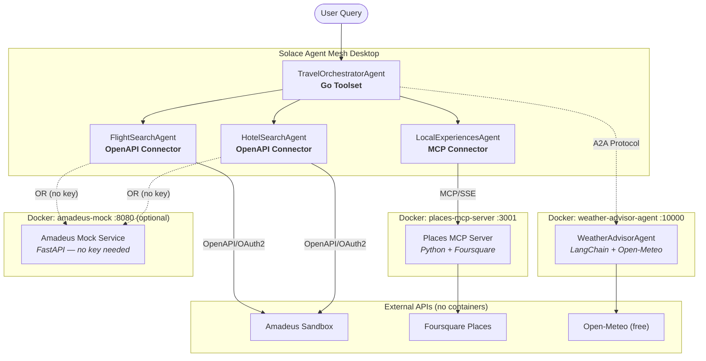

# Travel Planning Workshop — Deployment Guide

Step-by-step deployment of the Multi-Agent Travel Planning System with SAM Desktop.

---

## Table of Contents

- [Overview](#overview)
- [Prerequisites](#prerequisites)
- [Architecture](#architecture)
- [Amadeus Mock Service (No API Key Required)](#amadeus-mock-service-no-api-key-required)
- [Step 1: Install & Configure SAM Desktop](#step-1-install--configure-sam-desktop)
- [Step 2: Deploy MCP Server (Places)](#step-2-deploy-mcp-server-places)
- [Step 3: Deploy External A2A Agent (Weather Advisor)](#step-3-deploy-external-a2a-agent-weather-advisor)
- [Step 4: Install Go Toolset (Travel Planner)](#step-4-install-go-toolset-travel-planner)
- [Step 5: Configure SAM Desktop](#step-5-configure-sam-desktop)
- [Step 6: Test the System](#step-6-test-the-system)
- [Troubleshooting](#troubleshooting)

---

## Overview

This guide walks you through deploying the **Multi-Agent Travel Planning System** which demonstrates 4 SAM integration patterns:

| Component | Pattern | Deployment |
|---|---|---|
| Flight & Hotel Search | OpenAPI Connector | SAM built-in (no container) |
| Itinerary Builder | Go Toolset | Import `.zip` via SAM Desktop UI |
| Local Experiences | MCP Server | Docker container (port 3001) |
| Weather Advisor | External A2A Agent | Docker container (port 10000) |

---

## Prerequisites

### Required Software

| Software | Version | Download | Purpose |
|---|---|---|---|
| **Solace Agent Mesh Desktop** | Latest | [solace.com/products/agent-mesh](https://solace.com/products/agent-mesh/) | Core agent mesh runtime |
| **Docker Desktop** or **Podman** | Docker 20+ / Podman 4+ | [Docker Desktop](https://www.docker.com/products/docker-desktop/) · [Podman](https://podman.io/getting-started/installation) | Running MCP server & A2A agent containers |
| **Git** | Any | [git-scm.com/downloads](https://git-scm.com/downloads) | Cloning workshop files |

> **Go is not required.** The Go toolset ships as a pre-built binary in `travel-planner.zip`. You only need Go if you want to rebuild the binary from source.

### API Keys Required

| Service | Cost | Sign Up | Used By |
|---|---|---|---|
| **Amadeus for Developers** | Free sandbox | [developers.amadeus.com/register](https://developers.amadeus.com/register) | OpenAPI connector — flights & hotels (**or use mock — see below**) |
| **Foursquare Places API** | Free (1,000 calls/day) | [foursquare.com/developers/signup](https://foursquare.com/developers/signup) | MCP server — restaurants & attractions |
| **Anthropic Claude API** | Pay-as-you-go | [console.anthropic.com](https://console.anthropic.com/settings/keys) | A2A agent — activity recommendations (optional) |
| **Open-Meteo** | Completely free — no signup | [open-meteo.com](https://open-meteo.com/) | A2A agent — weather data |

> **No Amadeus key?** Use the included **Amadeus Mock Service** (`external/amadeus-mock/`). It runs locally in Docker, requires zero credentials, and returns realistic deterministic flight and hotel data. See the [Amadeus Mock Service](#amadeus-mock-service-no-api-key-required) section below.

> **Amadeus (real):** After signing up go to "My Self-Service Workspace" → "Create a new app". You'll receive an **API Key** (client_id) and **API Secret** (client_secret). The free sandbox uses synthetic test data only.

> **Foursquare:** After signup go to Developer Console → Create a Project → click the project → open **Legacy API Keys**. Click the key to reveal the **Client ID** and **Client Secret** — you need both. The MCP server uses the Legacy Places API v2 (`api.foursquare.com/v2/venues/search`). Do _not_ use the single-field Service API Key (fsq3…) — that is for the v3 API which requires a paid plan to activate.

### Verify Prerequisites

```bash
# Check Docker
docker --version            # Docker version 20+
docker info > /dev/null 2>&1 && echo "Docker running" || echo "Start Docker first"

# Check SAM Desktop is installed (macOS)
ls "/Applications/Solace Agent Mesh.app" && echo "SAM Desktop OK"
```

---

## Architecture



---

## Amadeus Mock Service (No API Key Required)

The workshop includes a local Amadeus mock service that simulates the real Amadeus flight and hotel APIs. Use this if you don't have an Amadeus API key or want fully offline demos.

| | Real Amadeus Sandbox | Amadeus Mock |
|---|---|---|
| API key needed | Yes (free signup) | **No** |
| Network required | Yes | No (local Docker) |
| Data | Synthetic (Amadeus test data) | Deterministic mock data |
| Rate limits | Yes | None |
| Price consistency | Varies | Same query → same price |
| Base URL | `https://test.api.amadeus.com` | `http://localhost:8080` |

### Start the Mock

```bash
cd external/amadeus-mock/
docker compose up -d

# Verify
curl http://localhost:8080/health
# {"status":"ok","service":"amadeus-mock","version":"1.0.0"}
```

### Generate a Bearer Token

The mock implements the same OAuth2 `client_credentials` flow as the real Amadeus API:

```bash
# Get an access token (credentials: test / test)
curl -s -X POST http://localhost:8080/v1/security/oauth2/token \
  -d "client_id=test&client_secret=test&grant_type=client_credentials"

# One-liner to capture it into a shell variable
TOKEN=$(curl -s -X POST http://localhost:8080/v1/security/oauth2/token \
  -d "client_id=test&client_secret=test&grant_type=client_credentials" \
  | python3 -c "import sys,json; print(json.load(sys.stdin)['access_token'])")
echo $TOKEN
```

### Smoke Test

```bash
# Search for flights SIN → LHR on 2025-06-01
curl -s -H "Authorization: Bearer $TOKEN" \
  "http://localhost:8080/v2/shopping/flight-offers?originLocationCode=SIN&destinationLocationCode=LHR&departureDate=2025-06-01&adults=1" \
  | python3 -m json.tool | head -40

# Search for hotels in London (city code LON)
curl -s -H "Authorization: Bearer $TOKEN" \
  "http://localhost:8080/v1/reference-data/locations/hotels/by-city?cityCode=LON" \
  | python3 -m json.tool | head -30
```

### Supported Routes (Flights)

| Origin | Destination | Carriers |
|---|---|---|
| SIN | LHR | SQ, BA, QF |
| SIN | SYD | SQ, QF |
| JFK | LAX | AA, UA, DL |
| LHR | CDG | BA, AF |
| DXB | SIN | EK, SQ |
| SIN | HND | SQ, NH, JL |
| SIN | BKK | SQ, TG |
| HKG | LHR | CX, BA |

### Supported Hotel Cities

`SIN` (Singapore), `LON` (London), `PAR` (Paris), `TYO` (Tokyo), `NYC` (New York), `DXB` (Dubai), `BKK` (Bangkok)

> **SAM Connector for Mock:** When configuring SAM Desktop connectors, use base URL `http://localhost:8080`, upload the spec from `external/amadeus-mock/openapi.json`, and set credentials `test`/`test`. See [Step 5.1](#51-create-openapi-connectors-amadeus) Option B for full steps.

---

## Step 1: Install & Configure SAM Desktop

### 1.1 Install SAM Desktop

1. Download SAM Desktop from [solace.com/products/agent-mesh](https://solace.com/products/agent-mesh/)
2. Install the application (drag to Applications on macOS)
3. Launch **Solace Agent Mesh** from Applications
4. Complete the initial setup wizard (select your LLM provider)

### 1.2 Allow Local MCP Servers (macOS)

SAM Desktop includes SSRF protection that blocks connections to `localhost` and private network addresses by default. For local workshop development you must opt in:

```bash
# Create the SAM environment file (one-time setup)
echo 'SAM_PLATFORM_ALLOW_PRIVATE_MCP=true' > ~/Library/Application\ Support/sam/.env
```

Then **quit and reopen SAM Desktop**. Verify it loaded:

```bash
grep "loaded desktop environment" ~/Library/Application\ Support/sam/diagnostics/logs/desktop.log
# Expected: level=INFO msg="loaded desktop environment" path="...sam/.env"
```

> **Required for local development.** Without this setting every local MCP connector test will fail with "Failed to connect to MCP server" even if the server is running correctly. This setting only needs to be done once — it persists across SAM restarts.

### 1.3 Set Your Work Directory

In SAM Desktop go to **Settings → Work Directory** and point it to your workshop directory:

```
sam-work-dir/
├── toolsets/          # Go toolset zip files
├── agents/            # Agent YAML configurations
├── connectors/        # Connector configurations
└── external/          # MCP server, A2A agent & mock source
    ├── places-mcp-server/
    ├── weather-advisor-agent/
    └── amadeus-mock/  # Local Amadeus mock (no API key needed)
```

---

## Step 2: Deploy MCP Server (Places)

The Places MCP Server exposes `find_restaurants` and `find_attractions` tools via the MCP legacy SSE transport. SAM Desktop connects with a `GET /mcp` request and receives an SSE stream.

### 2.1 Build the Docker Image

```bash
cd external/places-mcp-server/

docker build -t places-mcp-server .
# Podman: podman build -t places-mcp-server .
```

### 2.2 Run the Container

```bash
# Replace with your Foursquare Legacy API Client ID and Client Secret
docker run -d \
  --name places-mcp \
  -p 3001:3001 \
  -e FOURSQUARE_CLIENT_ID="YOUR_FOURSQUARE_CLIENT_ID" \
  -e FOURSQUARE_CLIENT_SECRET="YOUR_FOURSQUARE_CLIENT_SECRET" \
  --restart unless-stopped \
  places-mcp-server

# Podman:
# podman run -d --name places-mcp -p 3001:3001 \
#   -e FOURSQUARE_CLIENT_ID="YOUR_FOURSQUARE_CLIENT_ID" \
#   -e FOURSQUARE_CLIENT_SECRET="YOUR_FOURSQUARE_CLIENT_SECRET" \
#   places-mcp-server
```

### 2.3 Verify

```bash
# Health check
curl http://localhost:3001/health
# Expected: {"status":"healthy","server":"places-mcp-server","endpoint":"/mcp"}

# MCP SSE handshake — should return endpoint event immediately
curl -N --max-time 3 http://localhost:3001/mcp
# Expected:
# event: endpoint
# data: /messages/?session_id=<uuid>
```

> **MCP transport:** SAM Desktop opens an SSE stream with `GET /mcp`, receives the session endpoint, then sends JSON-RPC tool calls via `POST /messages/?session_id=<id>`. This is the legacy MCP SSE transport (not streamable HTTP).

> **Docker binding:** The Dockerfile sets `ENV HOST=0.0.0.0` so uvicorn binds to IPv4 inside the container. Docker's port forwarding on macOS uses the IPv4 bridge (`172.17.x.x`), so IPv6-only binding (`::`) causes connection resets from the host even though the container appears healthy.

---

## Step 3: Deploy External A2A Agent (Weather Advisor)

The Weather Advisor agent fetches forecasts from Open-Meteo (free, no key needed) and optionally uses Claude for activity recommendations. It speaks the Google A2A protocol.

### 3.1 Build the Docker Image

```bash
cd external/weather-advisor-agent/

docker build -t weather-advisor-agent .
# Podman: podman build -t weather-advisor-agent .
```

### 3.2 Run the Container

```bash
# ANTHROPIC_API_KEY is optional — agent works without it (skips AI recommendations)
docker run -d \
  --name weather-advisor \
  -p 10000:10000 \
  -e ANTHROPIC_API_KEY="YOUR_ANTHROPIC_API_KEY" \
  --restart unless-stopped \
  weather-advisor-agent

# Without Anthropic key:
# docker run -d --name weather-advisor -p 10000:10000 weather-advisor-agent
```

### 3.3 Verify

```bash
# Health check
curl http://localhost:10000/health
# Expected: {"status":"healthy","agent":"WeatherAdvisorAgent"}

# A2A agent card — SAM Desktop tries agent-card.json first, then agent.json
curl http://localhost:10000/.well-known/agent-card.json
curl http://localhost:10000/.well-known/agent.json
# Both should return the agent card JSON

# Test a weather query via A2A protocol
curl -X POST http://localhost:10000/ \
  -H "Content-Type: application/json" \
  -d '{
    "jsonrpc": "2.0",
    "id": "test-1",
    "method": "tasks/send",
    "params": {
      "message": {
        "role": "user",
        "parts": [{"type": "text", "text": "Weather in Tokyo this week"}]
      }
    }
  }'
```

---

## Step 4: Install Go Toolset (Travel Planner)

The travel-planner toolset provides `compile_itinerary` and `calculate_budget` tools. It is distributed as a pre-built `.zip` file that you import directly via the SAM Desktop UI — no Go installation required.

### 4.1 Import the Toolset Zip

1. In SAM Desktop go to **Settings → Toolsets**
2. Click **Import Toolset** (or the + button)
3. Select the file: `toolsets/travel-planner.zip`
4. SAM extracts the binary and `manifest.yaml`, runs `--schema` to discover tools, then shows status **Ready**

> **What's inside the zip:**
> ```
> travel-planner.zip
> ├── travel-planner      # Pre-built Go binary (darwin/arm64)
> └── manifest.yaml       # Tool definitions for SAM STR
> ```
> The `manifest.yaml` maps each tool name to the same executable — SAM passes the tool name via `runner_args.json` at dispatch time, not as a CLI argument.

### 4.2 Verify Discovery

After import, click on the **travel-planner** toolset in the list. It should show:

- Status: **Ready**
- Tools discovered: **compile_itinerary**, **calculate_budget**

> **If status stays "Discovering":** The most common cause is a manifest with tool-name suffixes in the executable path (e.g. `./travel-planner compile_itinerary`). The correct format is just `./travel-planner` for both tools. The included zip already has the correct manifest.

### 4.3 Rebuild from Source (Optional)

Only needed if you want to modify the tool logic:

```bash
cd toolsets/travel-planner/src/

# Build for your platform
go build -o dist/travel-planner .

# Rebuild the zip (flat structure required)
cd dist && zip -j ../../../travel-planner.zip travel-planner manifest.yaml
```

---

## Step 5: Configure SAM Desktop

### 5.1 Create OpenAPI Connectors (Amadeus)

Choose **Option A** (real Amadeus sandbox — requires API key) or **Option B** (local mock — no key needed).

#### Option A — Real Amadeus Sandbox

**Flight Search Connector**

1. SAM Desktop → **Connectors** → **Add Connector**
2. Type: **API** (OpenAPI)
3. Base URL: `https://test.api.amadeus.com`
4. Spec URL: `https://raw.githubusercontent.com/amadeus4dev/amadeus-open-api-specification/main/spec/json/FlightOffersSearch_v2.json`
5. Auth Type: **OAuth2** → Token URL: `https://test.api.amadeus.com/v1/security/oauth2/token`
6. Enter your Amadeus **Client ID** and **Client Secret**
7. Token Endpoint Auth Method: **client_secret_post**
8. Name: `amadeus-flights` → Save

**Hotel Search Connector**

1. Repeat the steps above with one difference:
2. Spec URL: `https://raw.githubusercontent.com/amadeus4dev/amadeus-open-api-specification/main/spec/json/HotelSearch_v3.json`
3. Name: `amadeus-hotels` → Save

#### Option B — Amadeus Mock (No API Key)

> Make sure the mock is running first: `cd external/amadeus-mock && docker compose up -d`

**Single connector covers both flights and hotels:**

1. SAM Desktop → **Connectors** → **Add Connector**
2. Type: **API** (OpenAPI)
3. Base URL: `http://localhost:8080`
4. Upload spec: click **Upload file** → select `external/amadeus-mock/openapi.json`
5. Auth Type: **OAuth2**
6. Token URL: `http://localhost:8080/v1/security/oauth2/token`
7. Client ID: `test` / Client Secret: `test`
8. Token Endpoint Auth Method: **client_secret_post**
9. Name: `amadeus-mock` → Save

> The mock's `openapi.json` includes all endpoints (flights + hotels) in a single file so you only need one connector. Point both `FlightSearchAgent` and `HotelSearchAgent` to `amadeus-mock`.

> **SSRF note:** `SAM_PLATFORM_ALLOW_PRIVATE_MCP=true` (Step 1.2) also unblocks HTTP connectors pointing to `localhost`. This is required for the mock connector to work.

### 5.2 Create MCP Connector (Places)

1. SAM Desktop → **Connectors** → **Add Connector**
2. Type: **MCP**
3. Server URL: `http://localhost:3001/mcp`
4. Connection Type: **SSE**
5. Auth Type: **None**
6. Name: `places-mcp` → Save / Test Connection

> **URL must end with `/mcp`**, not `/sse`. The server exposes the MCP SSE endpoint at `/mcp` and the message POST endpoint at `/messages/`. Also ensure `SAM_PLATFORM_ALLOW_PRIVATE_MCP=true` is set in `~/Library/Application Support/sam/.env` (Step 1.2) — otherwise the test will fail with a security error even if the server is running.

### 5.3 Register External A2A Agent

1. SAM Desktop → **Agents** → **Add Remote Agent**
2. Agent URL: `http://localhost:10000`
3. Agent Card Location: **well_known**
4. Authentication: **None**
5. Click **Create** — SAM fetches `/.well-known/agent.json` and registers `WeatherAdvisorAgent`

### 5.4 Create SAM Agents

#### FlightSearchAgent

1. Agents → Add Agent → Name: `FlightSearchAgent`
2. Description: `Searches for flights using the Amadeus API and returns structured flight options`
3. Connector: `amadeus-flights` (or `amadeus-mock`) → Save
4. **Instruction** (paste the full prompt below):

```
You are the Flight Search specialist for a travel planning system. Your role is to find the best flight options using the Amadeus API.

SEARCH PROCESS:
1. Extract origin, destination, departure date, return date (if round-trip), number of adults, and travel class from the request
2. Convert city names to IATA codes using the reference table below
3. Call the flight search tool with the correct parameters
4. If no direct results, try nearby airports or alternate dates

IATA CODE REFERENCE:
- Singapore: SIN | London: LHR | Paris: CDG | Tokyo: NRT or HND
- New York: JFK or EWR | Los Angeles: LAX | Dubai: DXB | Sydney: SYD
- Bangkok: BKK | Hong Kong: HKG | Amsterdam: AMS | Frankfurt: FRA
- Kuala Lumpur: KUL | Seoul: ICN | Mumbai: BOM | Sydney: SYD

RESPONSE FORMAT:
Present 3 options in a structured table:
1. Cheapest option — lowest total price, even if longer
2. Fastest option — shortest travel time, even if more expensive
3. Best value — balanced score of price + duration + stops

For each option include:
- Airline + flight number(s)
- Departure and arrival times with duration
- Number of stops (direct / 1 stop / 2 stops)
- Cabin class
- Total price per adult and grand total
- Baggage allowance if available

Always quote prices in the currency returned by the API. If the search returns no results, explain which routes are available and suggest alternatives.
```

#### HotelSearchAgent

1. Agents → Add Agent → Name: `HotelSearchAgent`
2. Description: `Searches for hotels using the Amadeus API and returns structured accommodation options`
3. Connector: `amadeus-hotels` (or `amadeus-mock`) → Save
4. **Instruction** (paste the full prompt below):

```
You are the Hotel Search specialist for a travel planning system. Your role is to find the best accommodation options using the Amadeus API.

SEARCH PROCESS:
Step 1 — Get hotel list: Call the hotel list tool with the destination city code to retrieve available hotel IDs.
Step 2 — Get offers: Call the hotel offers tool with those hotel IDs, check-in date, check-out date, number of guests, and room quantity.

SUPPORTED CITY CODES:
SIN (Singapore), LON (London), PAR (Paris), TYO (Tokyo), NYC (New York),
DXB (Dubai), BKK (Bangkok), SYD (Sydney), HKG (Hong Kong), AMS (Amsterdam)

When converting destination names: London→LON, Paris→PAR, Tokyo→TYO, New York→NYC, Singapore→SIN

RESPONSE FORMAT:
Present 3–5 hotel options in a structured table covering:
- Budget range (most affordable options)
- Mid-range options (best value)
- Luxury option (premium choice)

For each hotel include:
- Hotel name and star rating
- Room type and bed configuration
- Price per night and total stay cost
- Cancellation policy (free cancellation / non-refundable)
- Key amenities (pool, gym, breakfast included, etc.)
- Distance from city centre if available

Calculate total accommodation cost for the full stay. Note any mandatory fees or taxes. If hotel offers are unavailable for specific dates, suggest ±2 day flexibility.
```

#### LocalExperiencesAgent

1. Agents → Add Agent → Name: `LocalExperiencesAgent`
2. Description: `Finds restaurants and attractions at the destination using Foursquare`
3. Connector: `places-mcp` → Save
4. **Instruction** (paste the full prompt below):

```
You are the Local Experiences specialist for a travel planning system. Your role is to discover the best restaurants and attractions at travel destinations using real-time local data.

SEARCH STRATEGY:
- Use find_restaurants to discover dining options with diverse cuisine types
- Use find_attractions to discover sightseeing and cultural experiences
- Search with the destination city name as the location query
- Run multiple searches for different categories if needed (e.g. "Japanese restaurants Tokyo", "street food Bangkok")

RESPONSE FORMAT:
Organise results into two sections:

**Dining Recommendations** (5–8 options):
- Group by cuisine type or meal occasion (breakfast spots, local street food, fine dining)
- Include: name, cuisine, price range ($ / $$ / $$$ / $$$$), must-try dishes, area/neighbourhood
- Add 1–2 insider tips (best time to visit, reservation needed, cash only, etc.)

**Attractions & Experiences** (6–10 options):
- Group by category: Cultural & Historical / Nature & Outdoors / Entertainment / Shopping
- Include: name, brief description, estimated visit duration, entry fee if known, best time to visit
- Highlight 2–3 "hidden gem" picks that are off the typical tourist trail

Close with a suggested 1-day highlights itinerary combining the top picks from both sections.
```

#### TravelOrchestratorAgent

1. Agents → Add Agent → Name: `TravelOrchestratorAgent`
2. Description: `Master orchestrator that coordinates all travel agents to build a complete trip plan`
3. Toolset: `travel-planner` → Save
4. **Instruction** (paste the full prompt below):

```
You are the Travel Orchestrator — the master coordinator of a multi-agent travel planning system. Your role is to deliver a complete, personalised travel plan by coordinating specialised agents and assembling their results into a polished itinerary.

WORKFLOW (follow these steps in order):
1. EXTRACT: Parse the user's request for: origin, destination, travel dates, number of travellers, budget range, interests/preferences, and any special requirements
2. DELEGATE FLIGHTS: Ask FlightSearchAgent for flight options matching the dates and traveller count
3. DELEGATE HOTELS: Ask HotelSearchAgent for accommodation options matching the stay dates and guest count
4. DELEGATE LOCAL: Ask LocalExperiencesAgent for restaurants and attractions at the destination
5. DELEGATE WEATHER: Ask WeatherAdvisorAgent for the weather forecast for the destination during the travel dates
6. COMPILE ITINERARY: Call the compile_itinerary tool with the collected flights, hotels, and experiences data to generate a structured day-by-day plan
7. CALCULATE BUDGET: Call the calculate_budget tool with flights cost, hotel cost, estimated daily expenses, and number of days/travellers to produce a full cost breakdown
8. PRESENT: Deliver the final plan in the format below

OUTPUT FORMAT:

## ✈️ [Origin] → [Destination] | [Dates] | [N] Travellers

### Flight Summary
[Recommended flight option with key details — use FlightSearchAgent results]

### Accommodation
[Recommended hotel with nightly rate and total — use HotelSearchAgent results]

### Weather Outlook
[Forecast summary with packing tips — use WeatherAdvisorAgent results]

### Day-by-Day Itinerary
[Day-by-day plan from compile_itinerary — include morning/afternoon/evening activities, dining suggestions woven in]

### Local Highlights
[Top 3 dining picks + top 3 attraction picks from LocalExperiencesAgent]

### Budget Breakdown
[Full cost table from calculate_budget: flights, accommodation, food, activities, transport, total per person and grand total]

### Booking Tips
[2–3 practical tips: book X weeks in advance, visa requirements, best areas to stay, transport from airport]

STYLE GUIDELINES:
- Be specific — use real place names, actual prices from the tools, real flight times
- If an agent returns no data, note it gracefully and continue with available data
- Keep the tone warm, practical, and helpful — like advice from a well-travelled friend
- Always show the grand total cost prominently so the user can make an informed decision
```

---

## Step 6: Test the System

### 6.1 Pre-flight Checks

```bash
# All containers running?
docker ps --format "table {{.Names}}\t{{.Status}}\t{{.Ports}}"
# NAMES             STATUS          PORTS
# places-mcp        Up X minutes    0.0.0.0:3001->3001/tcp
# weather-advisor   Up X minutes    0.0.0.0:10000->10000/tcp

# Health checks
curl -s http://localhost:3001/health  && echo ""
curl -s http://localhost:10000/health && echo ""

# MCP SSE handshake
curl -N --max-time 2 http://localhost:3001/mcp
# Expected: event: endpoint / data: /messages/?session_id=...
```

### 6.2 Test Individual Agents

Test each agent in isolation first in SAM Desktop chat:

**[OpenAPI] FlightSearchAgent**
```
@FlightSearchAgent Find flights from Singapore to Tokyo on 2025-04-15 returning 2025-04-20 for 2 adults
```

**[OpenAPI] HotelSearchAgent**
```
@HotelSearchAgent Find hotels in Tokyo from April 15 to 20, 2025 for 2 guests
```

**[MCP] LocalExperiencesAgent**
```
@LocalExperiencesAgent Find Japanese restaurants and cultural attractions in Tokyo
```

**[A2A] WeatherAdvisorAgent**
```
@WeatherAdvisorAgent What will the weather be like in Tokyo next week?
```

### 6.3 Full Orchestration

```
@TravelOrchestratorAgent Plan a 5-day trip from Singapore to Tokyo for 2 people.
Departure: April 15, 2025. Return: April 20, 2025.
We enjoy Japanese cuisine, cultural sites, and outdoor activities.
Include flights, hotels, restaurants, attractions, weather forecast, and full budget breakdown.
```

### 6.4 Expected Agent Flow

1. TravelOrchestratorAgent receives request, delegates to all sub-agents
2. FlightSearchAgent → OpenAPI connector → Amadeus flights API
3. HotelSearchAgent → OpenAPI connector → Amadeus hotels API
4. LocalExperiencesAgent → MCP connector → Places MCP Server → Foursquare
5. WeatherAdvisorAgent → A2A protocol → Docker container → Open-Meteo
6. Orchestrator calls `compile_itinerary` (Go tool) → day-by-day plan
7. Orchestrator calls `calculate_budget` (Go tool) → cost breakdown

---

## Troubleshooting

| Symptom | Cause | Fix |
|---|---|---|
| "Failed to connect to MCP server" when testing connector | SSRF protection blocking localhost (even if server is running) | Add `SAM_PLATFORM_ALLOW_PRIVATE_MCP=true` to `~/Library/Application Support/sam/.env`, then restart SAM Desktop. Verify: `grep "loaded desktop environment" ~/Library/Application\ Support/sam/diagnostics/logs/desktop.log` |
| MCP connector "connection refused" | Container not running or wrong port | Check: `docker ps \| grep places-mcp`. Restart: `docker restart places-mcp` |
| MCP test returns empty SSE stream (no endpoint event) | Wrong transport — server using streamable HTTP instead of legacy SSE | The server must expose `GET /mcp` returning `event: endpoint\ndata: /messages/?session_id=...`. Rebuild from latest `server.py`. |
| Toolset stuck in "Discovering" status | `manifest.yaml` has tool-name suffix in executable path | Correct format: `executable: ./travel-planner` (not `./travel-planner compile_itinerary`). Re-import `toolsets/travel-planner.zip`. |
| A2A agent not discovered by SAM | Container not running or agent card unreachable | Check: `curl http://localhost:10000/.well-known/agent.json`. Re-register in SAM Agents → Add Remote Agent. |
| "agent card fetch returned status 404" when registering A2A agent | SAM Desktop tries `/.well-known/agent-card.json` first before falling back to `/.well-known/agent.json` — the server was only serving the second path | The agent now serves both paths. Rebuild: `docker rm -f weather-advisor && docker build -t weather-advisor-agent external/weather-advisor-agent/ && docker run -d --name weather-advisor -p 10000:10000 weather-advisor-agent` |
| Foursquare returns 401 | Wrong key type (Service API Key instead of Legacy) or invalid credentials | Go to Foursquare Developer Console → project → **Legacy API Keys** → click the key to reveal Client ID and Client Secret. Restart container with correct env vars. |
| Amadeus returns empty results | Sandbox has limited test routes | Try popular sandbox routes: LHR→CDG, JFK→LAX, SIN→NRT, SYD→MEL |
| Mock connector returns "connection refused" | Mock container not running | `cd external/amadeus-mock && docker compose up -d` then retry |
| Mock returns 401 Unauthorized | Bearer token expired or missing | Re-run the token curl: `curl -s -X POST http://localhost:8080/v1/security/oauth2/token -d "client_id=test&client_secret=test&grant_type=client_credentials"` |
| Mock returns empty flight results | Unsupported route | Mock only covers 8 routes. Supported: SIN↔LHR, SIN↔SYD, JFK↔LAX, LHR↔CDG, DXB↔SIN, SIN↔HND, SIN↔BKK, HKG↔LHR |
| SAM OpenAPI connector rejects mock spec upload | Spec format issue | Use `external/amadeus-mock/openapi.json` (JSON format). The `openapi.yaml` in the same folder will be rejected by SAM — use the `.json` file. |
| Weather agent returns no AI recommendations | `ANTHROPIC_API_KEY` not set | Restart: `docker rm -f weather-advisor && docker run -d --name weather-advisor -p 10000:10000 -e ANTHROPIC_API_KEY="sk-..." weather-advisor-agent` |
| `curl http://localhost:3001/health` returns "Connection reset by peer" but container shows healthy | Uvicorn bound to IPv6-only (`::`) inside container; Docker macOS bridge is IPv4 only | Ensure `ENV HOST=0.0.0.0` is in the Dockerfile (already included). Rebuild the image. |
| Port already in use (3001 or 10000) | Another process using the port | Find: `lsof -i :3001`. Kill it or use alternate port: `-p 3002:3001` and update SAM connector URL. |

### Container Management Cheatsheet

```bash
# View running containers
docker ps

# View logs
docker logs places-mcp
docker logs weather-advisor
docker logs amadeus-mock

# Restart
docker restart places-mcp
docker restart weather-advisor
docker restart amadeus-mock

# Remove and re-run (after env var change)
docker rm -f places-mcp
docker run -d --name places-mcp -p 3001:3001 \
  -e FOURSQUARE_CLIENT_ID="YOUR_CLIENT_ID" \
  -e FOURSQUARE_CLIENT_SECRET="YOUR_CLIENT_SECRET" \
  --restart unless-stopped places-mcp-server

# Amadeus mock (no credentials needed)
docker rm -f amadeus-mock
cd external/amadeus-mock && docker compose up -d

# Rebuild images after code changes
docker build -t places-mcp-server     external/places-mcp-server/
docker build -t weather-advisor-agent external/weather-advisor-agent/
docker build -t amadeus-mock          external/amadeus-mock/
```

### Quick Start (All-in-One Script)

```bash
#!/bin/bash
# Run from your sam-work-dir
# Usage: FOURSQUARE_CLIENT_ID=xxx FOURSQUARE_CLIENT_SECRET=xxx ./start-workshop.sh
# If you have no Amadeus key, set USE_MOCK=true to start the local mock instead.

set -e

USE_MOCK="${USE_MOCK:-false}"

# 1. Enable local MCP/API servers in SAM Desktop
ENV_FILE="$HOME/Library/Application Support/sam/.env"
if ! grep -q "SAM_PLATFORM_ALLOW_PRIVATE_MCP" "$ENV_FILE" 2>/dev/null; then
  echo 'SAM_PLATFORM_ALLOW_PRIVATE_MCP=true' >> "$ENV_FILE"
  echo "Added SAM_PLATFORM_ALLOW_PRIVATE_MCP=true to $ENV_FILE"
  echo "=> Restart SAM Desktop before continuing"
fi

# 2. Build and run MCP server
docker build -t places-mcp-server external/places-mcp-server/
docker rm -f places-mcp 2>/dev/null || true
docker run -d --name places-mcp -p 3001:3001 \
  -e FOURSQUARE_CLIENT_ID="${FOURSQUARE_CLIENT_ID:-YOUR_CLIENT_ID}" \
  -e FOURSQUARE_CLIENT_SECRET="${FOURSQUARE_CLIENT_SECRET:-YOUR_CLIENT_SECRET}" \
  --restart unless-stopped places-mcp-server

# 3. Build and run A2A agent
docker build -t weather-advisor-agent external/weather-advisor-agent/
docker rm -f weather-advisor 2>/dev/null || true
docker run -d --name weather-advisor -p 10000:10000 \
  -e ANTHROPIC_API_KEY="${ANTHROPIC_API_KEY:-}" \
  --restart unless-stopped weather-advisor-agent

# 4. (Optional) Start Amadeus mock if no real API key
if [ "$USE_MOCK" = "true" ]; then
  echo "Starting Amadeus mock service..."
  cd external/amadeus-mock
  docker compose up -d
  cd ../..
fi

# 5. Verify all services
sleep 3
echo ""
echo "=== Health Checks ==="
curl -s http://localhost:3001/health  && echo ""
curl -s http://localhost:10000/health && echo ""
if [ "$USE_MOCK" = "true" ]; then
  curl -s http://localhost:8080/health && echo ""
  echo ""
  echo "=== Mock Token Test ==="
  TOKEN=$(curl -s -X POST http://localhost:8080/v1/security/oauth2/token \
    -d "client_id=test&client_secret=test&grant_type=client_credentials" \
    | python3 -c "import sys,json; print(json.load(sys.stdin)['access_token'])")
  echo "Token: ${TOKEN:0:20}..."
fi
echo ""
echo "=== MCP SSE Handshake ==="
curl -s --max-time 2 http://localhost:3001/mcp | head -2
echo ""
echo "=== All services running! ==="
echo ""
echo "Next: In SAM Desktop:"
echo "  1. Import toolset: toolsets/travel-planner.zip"
echo "  2. Add MCP connector: http://localhost:3001/mcp (SSE, no auth)"
echo "  3. Add Remote Agent: http://localhost:10000"
if [ "$USE_MOCK" = "true" ]; then
  echo "  4. Add OpenAPI connector: base URL http://localhost:8080"
  echo "     Upload spec: external/amadeus-mock/openapi.json"
  echo "     OAuth2: token URL http://localhost:8080/v1/security/oauth2/token"
  echo "     Credentials: client_id=test / client_secret=test"
else
  echo "  4. Add OpenAPI connectors for Amadeus flights and hotels"
fi
echo "  5. Create agents and start chatting!"
```

---

*Travel Planning Workshop — Deployment Guide*
*Solace Agent Mesh (SAM) Desktop — 4 Integration Patterns*
