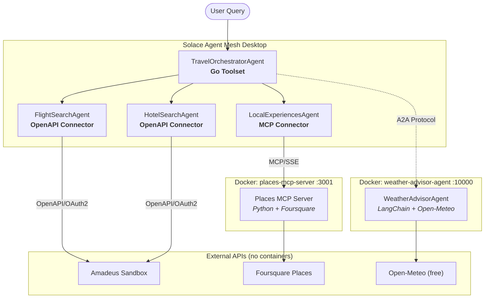

# Travel Planning Workshop — Deployment Guide

Step-by-step deployment of the Multi-Agent Travel Planning System with SAM Desktop.

---

## Table of Contents

- [Overview](#overview)
- [Prerequisites](#prerequisites)
- [Architecture](#architecture)
- [Step 1: Install & Configure SAM Desktop](#step-1-install--configure-sam-desktop)
- [Step 2: Deploy MCP Server (Places)](#step-2-deploy-mcp-server-places)
- [Step 3: Deploy External A2A Agent (Weather Advisor)](#step-3-deploy-external-a2a-agent-weather-advisor)
- [Step 4: Install Go Toolset (Travel Planner)](#step-4-install-go-toolset-travel-planner)
- [Step 5: Configure SAM Desktop](#step-5-configure-sam-desktop)
- [Step 6: Test the System](#step-6-test-the-system)
- [Troubleshooting](#troubleshooting)

---

## Overview

This guide walks you through deploying the **Multi-Agent Travel Planning System** which demonstrates 4 SAM integration patterns:

| Component | Pattern | Deployment |
|---|---|---|
| Flight & Hotel Search | OpenAPI Connector | SAM built-in (no container) |
| Itinerary Builder | Go Toolset | Import `.zip` via SAM Desktop UI |
| Local Experiences | MCP Server | Docker container (port 3001) |
| Weather Advisor | External A2A Agent | Docker container (port 10000) |

---

## Prerequisites

### Required Software

| Software | Version | Download | Purpose |
|---|---|---|---|
| **Solace Agent Mesh Desktop** | Latest | [solace.com/products/agent-mesh](https://solace.com/products/agent-mesh/) | Core agent mesh runtime |
| **Docker Desktop** or **Podman** | Docker 20+ / Podman 4+ | [Docker Desktop](https://www.docker.com/products/docker-desktop/) · [Podman](https://podman.io/getting-started/installation) | Running MCP server & A2A agent containers |
| **Git** | Any | [git-scm.com/downloads](https://git-scm.com/downloads) | Cloning workshop files |

> **Go is not required.** The Go toolset ships as a pre-built binary in `travel-planner.zip`. You only need Go if you want to rebuild the binary from source.

### API Keys Required

| Service | Cost | Sign Up | Used By |
|---|---|---|---|
| **Amadeus for Developers** | Free sandbox | [developers.amadeus.com/register](https://developers.amadeus.com/register) | OpenAPI connector — flights & hotels |
| **Foursquare Places API** | Free (1,000 calls/day) | [foursquare.com/developers/signup](https://foursquare.com/developers/signup) | MCP server — restaurants & attractions |
| **Anthropic Claude API** | Pay-as-you-go | [console.anthropic.com](https://console.anthropic.com/settings/keys) | A2A agent — activity recommendations (optional) |
| **Open-Meteo** | Completely free — no signup | [open-meteo.com](https://open-meteo.com/) | A2A agent — weather data |

> **Amadeus:** After signing up go to "My Self-Service Workspace" → "Create a new app". You'll receive an **API Key** (client_id) and **API Secret** (client_secret). The free sandbox uses synthetic test data only.

> **Foursquare:** After signup go to Developer Console → Create a Project → click the project → open **Legacy API Keys**. Click the key to reveal the **Client ID** and **Client Secret** — you need both. The MCP server uses the Legacy Places API v2 (`api.foursquare.com/v2/venues/search`). Do _not_ use the single-field Service API Key (fsq3…) — that is for the v3 API which requires a paid plan to activate.

### Verify Prerequisites

```bash
# Check Docker
docker --version            # Docker version 20+
docker info > /dev/null 2>&1 && echo "Docker running" || echo "Start Docker first"

# Check SAM Desktop is installed (macOS)
ls "/Applications/Solace Agent Mesh.app" && echo "SAM Desktop OK"
```

---

## Architecture



---

## Step 1: Install & Configure SAM Desktop

### 1.1 Install SAM Desktop

1. Download SAM Desktop from [solace.com/products/agent-mesh](https://solace.com/products/agent-mesh/)
2. Install the application (drag to Applications on macOS)
3. Launch **Solace Agent Mesh** from Applications
4. Complete the initial setup wizard (select your LLM provider)

### 1.2 Allow Local MCP Servers (macOS)

SAM Desktop includes SSRF protection that blocks connections to `localhost` and private network addresses by default. For local workshop development you must opt in:

```bash
# Create the SAM environment file (one-time setup)
echo 'SAM_PLATFORM_ALLOW_PRIVATE_MCP=true' > ~/Library/Application\ Support/sam/.env
```

Then **quit and reopen SAM Desktop**. Verify it loaded:

```bash
grep "loaded desktop environment" ~/Library/Application\ Support/sam/diagnostics/logs/desktop.log
# Expected: level=INFO msg="loaded desktop environment" path="...sam/.env"
```

> **Required for local development.** Without this setting every local MCP connector test will fail with "Failed to connect to MCP server" even if the server is running correctly. This setting only needs to be done once — it persists across SAM restarts.

### 1.3 Set Your Work Directory

In SAM Desktop go to **Settings → Work Directory** and point it to your workshop directory:

```
sam-work-dir/
├── toolsets/          # Go toolset zip files
├── agents/            # Agent YAML configurations
├── connectors/        # Connector configurations
└── external/          # MCP server & A2A agent source
```

---

## Step 2: Deploy MCP Server (Places)

The Places MCP Server exposes `find_restaurants` and `find_attractions` tools via the MCP legacy SSE transport. SAM Desktop connects with a `GET /mcp` request and receives an SSE stream.

### 2.1 Build the Docker Image

```bash
cd external/places-mcp-server/

docker build -t places-mcp-server .
# Podman: podman build -t places-mcp-server .
```

### 2.2 Run the Container

```bash
# Replace with your Foursquare Legacy API Client ID and Client Secret
docker run -d \
  --name places-mcp \
  -p 3001:3001 \
  -e FOURSQUARE_CLIENT_ID="YOUR_FOURSQUARE_CLIENT_ID" \
  -e FOURSQUARE_CLIENT_SECRET="YOUR_FOURSQUARE_CLIENT_SECRET" \
  --restart unless-stopped \
  places-mcp-server

# Podman:
# podman run -d --name places-mcp -p 3001:3001 \
#   -e FOURSQUARE_CLIENT_ID="YOUR_FOURSQUARE_CLIENT_ID" \
#   -e FOURSQUARE_CLIENT_SECRET="YOUR_FOURSQUARE_CLIENT_SECRET" \
#   places-mcp-server
```

### 2.3 Verify

```bash
# Health check
curl http://localhost:3001/health
# Expected: {"status":"healthy","server":"places-mcp-server","endpoint":"/mcp"}

# MCP SSE handshake — should return endpoint event immediately
curl -N --max-time 3 http://localhost:3001/mcp
# Expected:
# event: endpoint
# data: /messages/?session_id=<uuid>
```

> **MCP transport:** SAM Desktop opens an SSE stream with `GET /mcp`, receives the session endpoint, then sends JSON-RPC tool calls via `POST /messages/?session_id=<id>`. This is the legacy MCP SSE transport (not streamable HTTP).

> **Docker binding:** The Dockerfile sets `ENV HOST=0.0.0.0` so uvicorn binds to IPv4 inside the container. Docker's port forwarding on macOS uses the IPv4 bridge (`172.17.x.x`), so IPv6-only binding (`::`) causes connection resets from the host even though the container appears healthy.

---

## Step 3: Deploy External A2A Agent (Weather Advisor)

The Weather Advisor agent fetches forecasts from Open-Meteo (free, no key needed) and optionally uses Claude for activity recommendations. It speaks the Google A2A protocol.

### 3.1 Build the Docker Image

```bash
cd external/weather-advisor-agent/

docker build -t weather-advisor-agent .
# Podman: podman build -t weather-advisor-agent .
```

### 3.2 Run the Container

```bash
# ANTHROPIC_API_KEY is optional — agent works without it (skips AI recommendations)
docker run -d \
  --name weather-advisor \
  -p 10000:10000 \
  -e ANTHROPIC_API_KEY="YOUR_ANTHROPIC_API_KEY" \
  --restart unless-stopped \
  weather-advisor-agent

# Without Anthropic key:
# docker run -d --name weather-advisor -p 10000:10000 weather-advisor-agent
```

### 3.3 Verify

```bash
# Health check
curl http://localhost:10000/health
# Expected: {"status":"healthy","agent":"WeatherAdvisorAgent"}

# A2A agent card — SAM Desktop tries agent-card.json first, then agent.json
curl http://localhost:10000/.well-known/agent-card.json
curl http://localhost:10000/.well-known/agent.json
# Both should return the agent card JSON

# Test a weather query via A2A protocol
curl -X POST http://localhost:10000/ \
  -H "Content-Type: application/json" \
  -d '{
    "jsonrpc": "2.0",
    "id": "test-1",
    "method": "tasks/send",
    "params": {
      "message": {
        "role": "user",
        "parts": [{"type": "text", "text": "Weather in Tokyo this week"}]
      }
    }
  }'
```

---

## Step 4: Install Go Toolset (Travel Planner)

The travel-planner toolset provides `compile_itinerary` and `calculate_budget` tools. It is distributed as a pre-built `.zip` file that you import directly via the SAM Desktop UI — no Go installation required.

### 4.1 Import the Toolset Zip

1. In SAM Desktop go to **Settings → Toolsets**
2. Click **Import Toolset** (or the + button)
3. Select the file: `toolsets/travel-planner.zip`
4. SAM extracts the binary and `manifest.yaml`, runs `--schema` to discover tools, then shows status **Ready**

> **What's inside the zip:**
> ```
> travel-planner.zip
> ├── travel-planner      # Pre-built Go binary (darwin/arm64)
> └── manifest.yaml       # Tool definitions for SAM STR
> ```
> The `manifest.yaml` maps each tool name to the same executable — SAM passes the tool name via `runner_args.json` at dispatch time, not as a CLI argument.

### 4.2 Verify Discovery

After import, click on the **travel-planner** toolset in the list. It should show:

- Status: **Ready**
- Tools discovered: **compile_itinerary**, **calculate_budget**

> **If status stays "Discovering":** The most common cause is a manifest with tool-name suffixes in the executable path (e.g. `./travel-planner compile_itinerary`). The correct format is just `./travel-planner` for both tools. The included zip already has the correct manifest.

### 4.3 Rebuild from Source (Optional)

Only needed if you want to modify the tool logic:

```bash
cd toolsets/travel-planner/src/

# Build for your platform
go build -o dist/travel-planner .

# Rebuild the zip (flat structure required)
cd dist && zip -j ../../../travel-planner.zip travel-planner manifest.yaml
```

---

## Step 5: Configure SAM Desktop

### 5.1 Create OpenAPI Connectors (Amadeus)

#### Flight Search Connector

1. SAM Desktop → **Connectors** → **Add Connector**
2. Type: **API** (OpenAPI)
3. Base URL: `https://test.api.amadeus.com`
4. Spec URL: `https://raw.githubusercontent.com/amadeus4dev/amadeus-open-api-specification/main/spec/json/FlightOffersSearch_v2.json`
5. Auth Type: **OAuth2** → Token URL: `https://test.api.amadeus.com/v1/security/oauth2/token`
6. Enter your Amadeus **Client ID** and **Client Secret**
7. Token Endpoint Auth Method: **client_secret_post**
8. Name: `amadeus-flights` → Save

#### Hotel Search Connector

1. Repeat the steps above with one difference:
2. Spec URL: `https://raw.githubusercontent.com/amadeus4dev/amadeus-open-api-specification/main/spec/json/HotelSearch_v3.json`
3. Name: `amadeus-hotels` → Save

### 5.2 Create MCP Connector (Places)

1. SAM Desktop → **Connectors** → **Add Connector**
2. Type: **MCP**
3. Server URL: `http://localhost:3001/mcp`
4. Connection Type: **SSE**
5. Auth Type: **None**
6. Name: `places-mcp` → Save / Test Connection

> **URL must end with `/mcp`**, not `/sse`. The server exposes the MCP SSE endpoint at `/mcp` and the message POST endpoint at `/messages/`. Also ensure `SAM_PLATFORM_ALLOW_PRIVATE_MCP=true` is set in `~/Library/Application Support/sam/.env` (Step 1.2) — otherwise the test will fail with a security error even if the server is running.

### 5.3 Register External A2A Agent

1. SAM Desktop → **Agents** → **Add Remote Agent**
2. Agent URL: `http://localhost:10000`
3. Agent Card Location: **well_known**
4. Authentication: **None**
5. Click **Create** — SAM fetches `/.well-known/agent.json` and registers `WeatherAdvisorAgent`

### 5.4 Create SAM Agents

#### FlightSearchAgent

1. Agents → Add Agent → Name: `FlightSearchAgent`
2. Description: `Searches for flights using the Amadeus API`
3. Instruction: `You are the Flight Search specialist. Use the getFlightOffers tool. Use IATA codes: SIN=Singapore, LHR=London, CDG=Paris, NRT=Tokyo, JFK=New York`
4. Connector: `amadeus-flights` → Save

#### HotelSearchAgent

1. Agents → Add Agent → Name: `HotelSearchAgent`
2. Description: `Searches for hotels using the Amadeus API`
3. Instruction: `You are the Hotel Search specialist. Use the getMultiHotelOffers tool. City codes: SIN, LON, PAR, TYO, NYC`
4. Connector: `amadeus-hotels` → Save

#### LocalExperiencesAgent

1. Agents → Add Agent → Name: `LocalExperiencesAgent`
2. Description: `Finds restaurants and attractions at the destination`
3. Instruction: `You are the Local Experiences specialist. Use find_restaurants and find_attractions tools to discover what to see and eat at the destination.`
4. Connector: `places-mcp` → Save

#### TravelOrchestratorAgent

1. Agents → Add Agent → Name: `TravelOrchestratorAgent`
2. Description: `Orchestrates multi-agent travel planning`
3. Instruction: `You are the Travel Orchestrator. Coordinate FlightSearchAgent, HotelSearchAgent, LocalExperiencesAgent, and WeatherAdvisorAgent to gather all travel information. Then use compile_itinerary to build the day-by-day plan and calculate_budget for the cost breakdown.`
4. Toolset: `travel-planner` → Save
5. Set "Can delegate to": FlightSearchAgent, HotelSearchAgent, LocalExperiencesAgent, WeatherAdvisorAgent

---

## Step 6: Test the System

### 6.1 Pre-flight Checks

```bash
# All containers running?
docker ps --format "table {{.Names}}\t{{.Status}}\t{{.Ports}}"
# NAMES             STATUS          PORTS
# places-mcp        Up X minutes    0.0.0.0:3001->3001/tcp
# weather-advisor   Up X minutes    0.0.0.0:10000->10000/tcp

# Health checks
curl -s http://localhost:3001/health  && echo ""
curl -s http://localhost:10000/health && echo ""

# MCP SSE handshake
curl -N --max-time 2 http://localhost:3001/mcp
# Expected: event: endpoint / data: /messages/?session_id=...
```

### 6.2 Test Individual Agents

Test each agent in isolation first in SAM Desktop chat:

**[OpenAPI] FlightSearchAgent**
```
@FlightSearchAgent Find flights from Singapore to Tokyo on 2025-04-15 returning 2025-04-20 for 2 adults
```

**[OpenAPI] HotelSearchAgent**
```
@HotelSearchAgent Find hotels in Tokyo from April 15 to 20, 2025 for 2 guests
```

**[MCP] LocalExperiencesAgent**
```
@LocalExperiencesAgent Find Japanese restaurants and cultural attractions in Tokyo
```

**[A2A] WeatherAdvisorAgent**
```
@WeatherAdvisorAgent What will the weather be like in Tokyo next week?
```

### 6.3 Full Orchestration

```
@TravelOrchestratorAgent Plan a 5-day trip from Singapore to Tokyo for 2 people.
Departure: April 15, 2025. Return: April 20, 2025.
We enjoy Japanese cuisine, cultural sites, and outdoor activities.
Include flights, hotels, restaurants, attractions, weather forecast, and full budget breakdown.
```

### 6.4 Expected Agent Flow

1. TravelOrchestratorAgent receives request, delegates to all sub-agents
2. FlightSearchAgent → OpenAPI connector → Amadeus flights API
3. HotelSearchAgent → OpenAPI connector → Amadeus hotels API
4. LocalExperiencesAgent → MCP connector → Places MCP Server → Foursquare
5. WeatherAdvisorAgent → A2A protocol → Docker container → Open-Meteo
6. Orchestrator calls `compile_itinerary` (Go tool) → day-by-day plan
7. Orchestrator calls `calculate_budget` (Go tool) → cost breakdown

---

## Troubleshooting

| Symptom | Cause | Fix |
|---|---|---|
| "Failed to connect to MCP server" when testing connector | SSRF protection blocking localhost (even if server is running) | Add `SAM_PLATFORM_ALLOW_PRIVATE_MCP=true` to `~/Library/Application Support/sam/.env`, then restart SAM Desktop. Verify: `grep "loaded desktop environment" ~/Library/Application\ Support/sam/diagnostics/logs/desktop.log` |
| MCP connector "connection refused" | Container not running or wrong port | Check: `docker ps \| grep places-mcp`. Restart: `docker restart places-mcp` |
| MCP test returns empty SSE stream (no endpoint event) | Wrong transport — server using streamable HTTP instead of legacy SSE | The server must expose `GET /mcp` returning `event: endpoint\ndata: /messages/?session_id=...`. Rebuild from latest `server.py`. |
| Toolset stuck in "Discovering" status | `manifest.yaml` has tool-name suffix in executable path | Correct format: `executable: ./travel-planner` (not `./travel-planner compile_itinerary`). Re-import `toolsets/travel-planner.zip`. |
| A2A agent not discovered by SAM | Container not running or agent card unreachable | Check: `curl http://localhost:10000/.well-known/agent.json`. Re-register in SAM Agents → Add Remote Agent. |
| "agent card fetch returned status 404" when registering A2A agent | SAM Desktop tries `/.well-known/agent-card.json` first before falling back to `/.well-known/agent.json` — the server was only serving the second path | The agent now serves both paths. Rebuild: `docker rm -f weather-advisor && docker build -t weather-advisor-agent external/weather-advisor-agent/ && docker run -d --name weather-advisor -p 10000:10000 weather-advisor-agent` |
| Foursquare returns 401 | Wrong key type (Service API Key instead of Legacy) or invalid credentials | Go to Foursquare Developer Console → project → **Legacy API Keys** → click the key to reveal Client ID and Client Secret. Restart container with correct env vars. |
| Amadeus returns empty results | Sandbox has limited test routes | Try popular sandbox routes: LHR→CDG, JFK→LAX, SIN→NRT, SYD→MEL |
| Weather agent returns no AI recommendations | `ANTHROPIC_API_KEY` not set | Restart: `docker rm -f weather-advisor && docker run -d --name weather-advisor -p 10000:10000 -e ANTHROPIC_API_KEY="sk-..." weather-advisor-agent` |
| `curl http://localhost:3001/health` returns "Connection reset by peer" but container shows healthy | Uvicorn bound to IPv6-only (`::`) inside container; Docker macOS bridge is IPv4 only | Ensure `ENV HOST=0.0.0.0` is in the Dockerfile (already included). Rebuild the image. |
| Port already in use (3001 or 10000) | Another process using the port | Find: `lsof -i :3001`. Kill it or use alternate port: `-p 3002:3001` and update SAM connector URL. |

### Container Management Cheatsheet

```bash
# View running containers
docker ps

# View logs
docker logs places-mcp
docker logs weather-advisor

# Restart
docker restart places-mcp
docker restart weather-advisor

# Remove and re-run (after env var change)
docker rm -f places-mcp
docker run -d --name places-mcp -p 3001:3001 \
  -e FOURSQUARE_CLIENT_ID="YOUR_CLIENT_ID" \
  -e FOURSQUARE_CLIENT_SECRET="YOUR_CLIENT_SECRET" \
  --restart unless-stopped places-mcp-server

# Rebuild images after code changes
docker build -t places-mcp-server    external/places-mcp-server/
docker build -t weather-advisor-agent external/weather-advisor-agent/
```

### Quick Start (All-in-One Script)

```bash
#!/bin/bash
# Run from your sam-work-dir

set -e

# 1. Enable local MCP servers in SAM Desktop
ENV_FILE="$HOME/Library/Application Support/sam/.env"
if ! grep -q "SAM_PLATFORM_ALLOW_PRIVATE_MCP" "$ENV_FILE" 2>/dev/null; then
  echo 'SAM_PLATFORM_ALLOW_PRIVATE_MCP=true' >> "$ENV_FILE"
  echo "Added SAM_PLATFORM_ALLOW_PRIVATE_MCP=true to $ENV_FILE"
  echo "=> Restart SAM Desktop before continuing"
fi

# 2. Build and run MCP server
docker build -t places-mcp-server external/places-mcp-server/
docker rm -f places-mcp 2>/dev/null || true
docker run -d --name places-mcp -p 3001:3001 \
  -e FOURSQUARE_CLIENT_ID="${FOURSQUARE_CLIENT_ID:-YOUR_CLIENT_ID}" \
  -e FOURSQUARE_CLIENT_SECRET="${FOURSQUARE_CLIENT_SECRET:-YOUR_CLIENT_SECRET}" \
  --restart unless-stopped places-mcp-server

# 3. Build and run A2A agent
docker build -t weather-advisor-agent external/weather-advisor-agent/
docker rm -f weather-advisor 2>/dev/null || true
docker run -d --name weather-advisor -p 10000:10000 \
  -e ANTHROPIC_API_KEY="${ANTHROPIC_API_KEY:-}" \
  --restart unless-stopped weather-advisor-agent

# 4. Verify
sleep 3
echo ""
echo "=== Health Checks ==="
curl -s http://localhost:3001/health  && echo ""
curl -s http://localhost:10000/health && echo ""
echo ""
echo "=== MCP SSE Handshake ==="
curl -s --max-time 2 http://localhost:3001/mcp | head -2
echo ""
echo "=== All services running! ==="
echo ""
echo "Next: In SAM Desktop:"
echo "  1. Import toolset: toolsets/travel-planner.zip"
echo "  2. Add MCP connector: http://localhost:3001/mcp (SSE, no auth)"
echo "  3. Add Remote Agent: http://localhost:10000"
echo "  4. Create agents and start chatting!"
```

---

*Travel Planning Workshop — Deployment Guide*
*Solace Agent Mesh (SAM) Desktop — 4 Integration Patterns*
